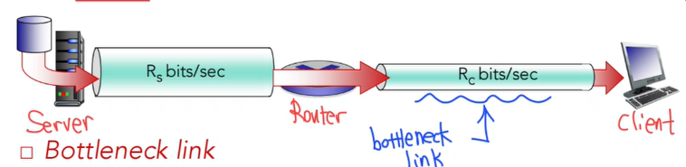
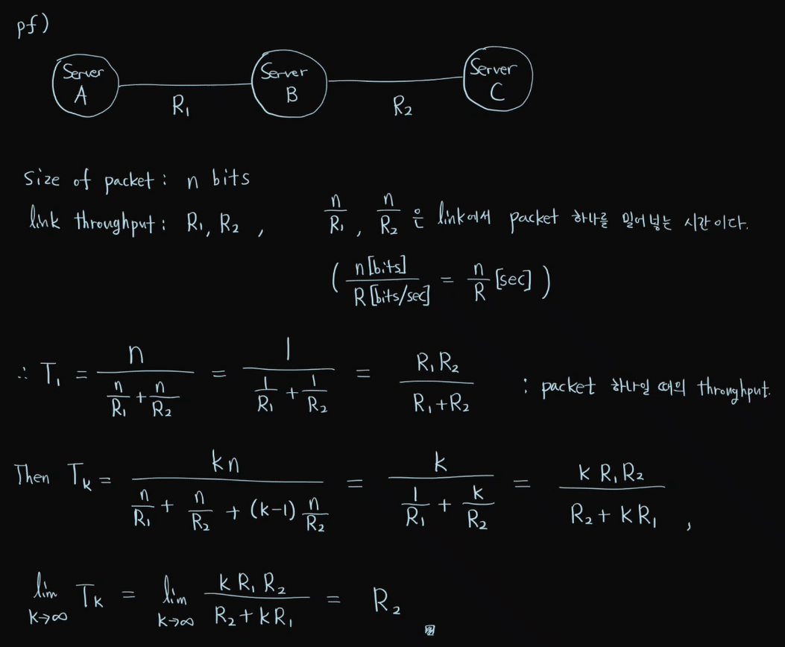
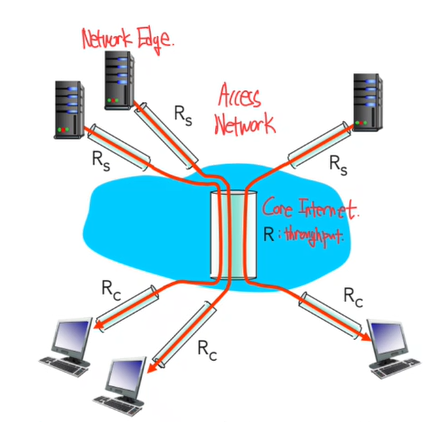
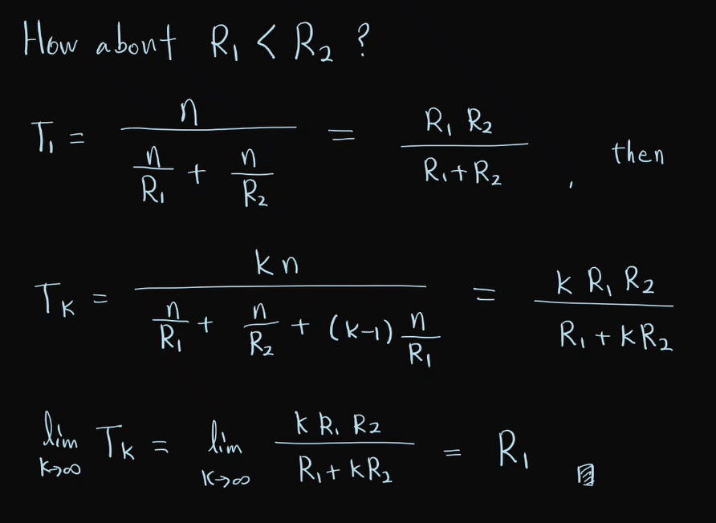

  * 수식이 제대로 보이지 않는다면, 새로고침(F5)을 해주시기 바랍니다.  

## **Throughput**
Throughput: 단위 시간당 실제로 전송된 데이터 양 [bits/sec]   
=> 얼마나 데이터를 빠르게 주고 받는 지 나타내는 값이다. throughput은 다음과 같이 계산된다.  

$$
\displaystyle
\text{Throughput}=\frac{\text{transmitted size of data [bits]}}{\text{total transmission time [sec]}}
$$

Throughput에는 instantaneous throughput과 average throughput이 있다. Instantaneous throughput은 순간적인 전송률을, average throughput은 일정 시간 구간 동안의 평균 전송률을 의미한다.  

## **Bottleneck link**
Bottleneck link는 병목 구간을 의미한다. 음료수 병을 보면 병의 몸통 부분 보다 머리 부분(입구 부분)이 훨씬 좁은데, 이런 이유로 인해 음료수가 한꺼번에 쏟아지지 않도록 해준다. 딱 입구 부분의 크기에 맞춰서 음료수가 나오게 되는 것이다. 그런데, 만약 데이터 전송을 위한 link가 이런 음료수 병처럼 생겼다면 데이터가 흘러가다가 Bottleneck 부분에서 느려지게 될 것이다. 이것이 병목 현상이다.  
  
네트워크에서 Bottleneck link는 여러 링크들 중 가장 전송률이 낮은 구간으로 정의 된다.  

  
위 그림에서, Server에서 Router로 향하는 link보다 Router에서 Client로 향하는 link의 폭이 좁은 것을 확인할 수 있다. 즉 throughput이 $$R_s>R_c$$이다. 그렇다면 이때, 패킷이 충분히 많다면 average end-to-end throughput은 얼마일까? 바로 $$T_{e2e}=min(R_s,R_c)$$가 된다. 즉, 여러 구간들 중 throughput이 가장 낮은 구간에 의해 전체 처리량이 결정된다. 왜 그럴까? 이를 증명해보겠다.  

### prove

즉, 패킷이 충분히 많을 때 결국 average end-to-end throughput은 $$R_2$$(bottleneck link의 throughput)에 수렴함을 확인하였다.  

### Throughput in Multiple connections
여러 개의 서버-클라이언트 쌍으로 이루어진 다중 연결 환경에서의 throughput은 어떻게 될지 알아보자.  

  
위 상황은 link capacity(R)을 10개의 연결이 공평하게 나누어 쓰는 상황이라고 가정한다.  
그림에서 throughput은 총 3종류가 존재한다. server-client link의 throughput인 $$R_s$$, Core Internet의 throughput $$R$$, access network(client-side access)의 throughput인 $$R_c$$가 있다. 
가정에 의해 1개의 link가 코어망에서 확보할 수 있는 최대 속도는 R/10이 된다. 그렇다면 이 때, end-to-end throughput은 얼마일까?  
위 내용에서 다루었던 것처럼, 가장 느린 링크에 의해 결정이 된다. 따라서 $$T_{e2e}=min(R_s,R_c,\frac{R}{10})$$이다.  
  
일반적인 식으로는 다음과 같이 표현할 수 있다.  

$$
\displaystyle
T_{e2e}=min(R_s,R_c,\frac{R}{N})
$$

  
  
실제로 병목 현상은 $$R_c$$나 $$R_s$$가 bottleneck일 때가 많은데, 왜 그럴까?  
사실 코어망은 대개 매우 빠른 속도를 가졌기 때문에 코어망에 의해 병목이 생기지는 않는다. 따라서 network edge 구간에서 자주 발생한다.  

---

## **Conclusion**
이번에는 Throughput과 Bottleneck에 대해서 알아보았다. 아래 연습 문제는 위 상황에서 throughput의 대소가 반대로 된 case에 대한 흥미로운 증명이니 직접 해 보시는 것을 추천드립니다.

## **Practice** 
1. 만약 $$R_1<R_2$$라면, average end-to-end throughput은 얼마일지 구하시오.

### Answer 

  
<strong>정답 보기</strong>

   
  

