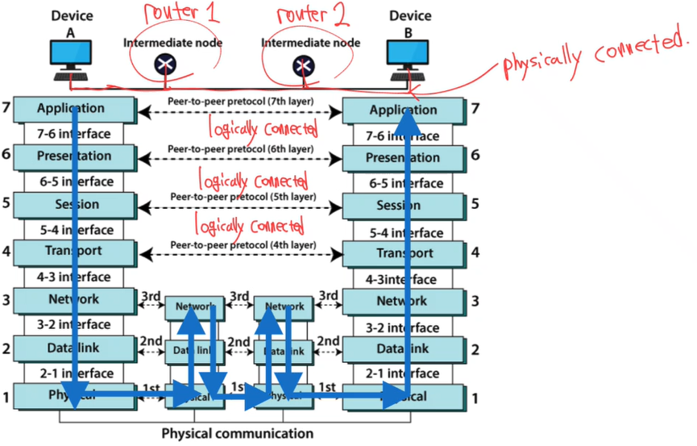
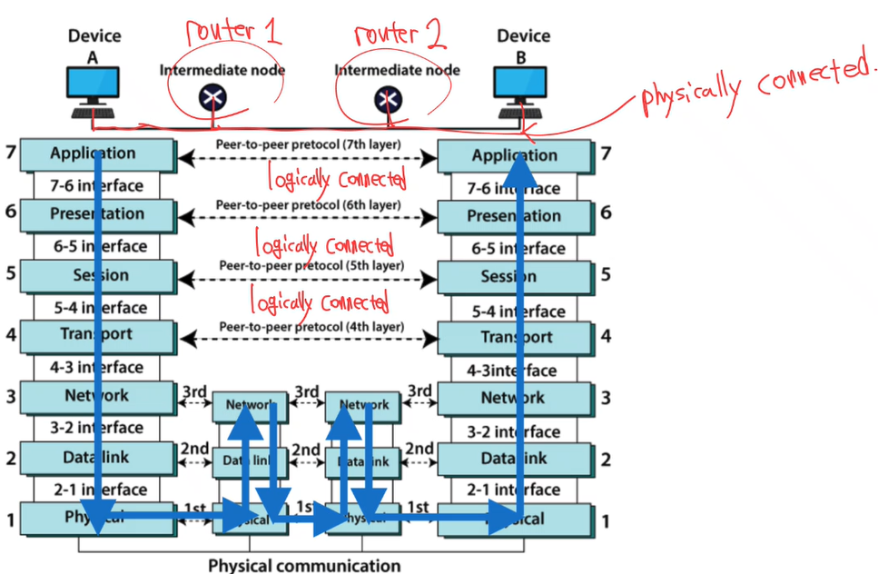

  * 수식이 제대로 보이지 않는다면, 새로고침(F5)을 해주시기 바랍니다.  

이번 내용에서는 OSI7 layer에 대해서 알아보겠습니다.  

## **The OSI Model**
- 국제 표준화 기구(ISO, International Standards Organization)이 제정한 네트워크 토신 표준  
- 네트워크 통신을 7개의 계층으로 나누어 표준화했으며, 1970년대 후반에 처음 제안되었음  

| 계층 번호 | 계층 이름                        | 주요 기능                                                                     | 중요성                        |
| :-------: | :------------------------------- | :---------------------------------------------------------------------------- | :---------------------------- |
|   **7**   | **Application (응용 계층)**      | 사용자와 가장 가까운 계층. 애플리케이션 간 데이터 교환 (예: HTTP, FTP, SMTP). | 서비스 측면에서 중요          |
|   **6**   | **Presentation (표현 계층)**     | 데이터 형식 변환, 암호화, 압축 수행.                                          | 서비스 측면에서 중요          |
|   **5**   | **Session (세션 계층)**          | 통신 세션의 설정, 유지, 종료 관리.                                            | 서비스 측면에서 중요          |
|   **4**   | **Transport (전송 계층)**        | 종단 간 데이터 전송 제어 (TCP, UDP 등). 신뢰성 보장 및 오류 제어.             | 컴퓨터 네트워크 측면에서 중요 |
|   **3**   | **Network (네트워크 계층)**      | 라우팅 및 주소 지정(IP). 서로 다른 네트워크 간 데이터 전달.                   | 컴퓨터 네트워크 측면에서 중요 |
|   **2**   | **Data Link (데이터 링크 계층)** | 같은 네트워크 내 노드 간 데이터 프레임 전송. MAC 주소 이용.                   | 데이터 통신 측면에서 중요     |
|   **1**   | **Physical (물리 계층)**         | 실제 전기·광 신호를 통해 비트 전송 수행. 케이블, 리피터, 허브 등.             | 물리적 통신 측면에서 중요     |

## Information Flow in OSI Model

지금까지 OSI Model의 데이터 흐름 및 큰 틀을 살펴봤으니, 이제부터는 각 계층 별 역할을 알아보겠습니다.  

## **Physical Layer**
비트를 실제 신호로 바꾸어서 link를 통해 전송하는 계층이다.  

- Synchronization of bits
- transmission mode: simplex, half-duplex, full-duplex  

## **Data Link Layer**
물리적으로 연결된 두 노드 사이(node-to-node) 에서 에러 없는 전송(error-free delivery) 을 담당한다.  
- Framing: 상위 계층에서 내려온 data stream을 작은 단위인 frame으로 쪼갠다.  
- Physical Addressing: Frame마다 출발지와 목적지의 주소를 붙인다. (MAC Address를 사용한다.)  
- Flow Control: 송신 측이 수신 측에 데이터를 너무 빠르게 보내면 처리를 못할 수 있기 때문에, 수신 측이 송신 측에게 데이터를 천천히 보내라는 신호를 보낸다.  
- Error Control: 에러를 찾아서 검출 후 재전송한다.  
- Access Control: 여러 장치가 같은 link를 사용할 때 누가 언제 전송할 지 결정한다. (Scheduling), e.g. CSMA/CA, CSMA/CD  

## **Network Layer**
- Logical Addressing: 송신자와 수신자의 IP address를 이용해 데이터의 이동방향을 결정한다. (header에 IP address 정보가 있음.)  
- Routing: sender에서 receiver까지의 최적 경로(cost-minimal path)를 찾는다. by using routing algorithm  
- End-to-End transmission

## **Transport Layer**
- Logical communication: 논리적 end-to-end 통신을 제공  
- Guarantee: source와 destination간의 데이터 전달을 보장한다.  
- Protocols: TCP/UDP  

## **Application Layer**
사용자나 애플리케이션이 직접 네트워크를 이용할 수 있게 해주는 계층.  
Write programs running on end devices: End devices에서 실행되는 프로그램을 개발하는 계층  
네트워크 내부의 라우터 같은 장비용 소프트웨어는 만들 필요 없음 => Application Layer 개발자는 통신 인프라를 직접 신경 쓸 필요가 없다!  
즉, 하위 계층은 이미 표준화가 되어 있기 때문에 개발자는 Application Layer만 신경 써서 빠르게 개발할 수 있다.  

---
## **Conclusion**
이번 시간에는 OSI7 Layer에 대해 알아봤습니다. 각 Layer에 대한 특징을 매우 자세하게 다루지는 않았습니다. 컴퓨터 네트워크 강의에서는 이제부터 자세히 Network Layer, Transport Layer, Application Layer에 대해 알아볼 예정입니다. Physical Layer와 Data Link Layer에 대한 자세한 설명은 '데이터통신' 강의에서 보실 수 있습니다. (추후 업로드 예정)
