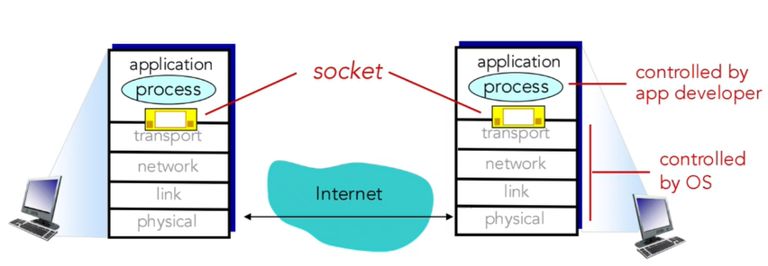

  * 수식이 제대로 보이지 않는다면, 새로고침(F5)을 해주시기 바랍니다.  

## **Network Application**
e-mail, web, streaming stored video 등 종류가 매우 많다.  
- network-core devices는 user applications을 실행할 필요가 없다.  
- end system(user devices)에서만 실행되기 때문에 빠르고 쉽게 개발할 수 있다.  

### **Application Architecture: P2P**
P2P(peer-to-peer) 방식을 알아보자. 항상 켜져있는 중앙 서버가 없는 구조이다. (no always-on server)  
각 end device들이 직접 통신한다 (directly communication)  
즉, 모든 기기(peer)들이 client이자 server 역할을 할 수 있다.
examples: 파일 공유, 블록체인, torrent  
  
P2P의 중요한 특징으로 self scalability가 있다. self scalability는 새로운 peer가 참가할수록, 서비스 처리 능력(capacity)와 자원(resource)가 함께 증가한다. 즉 확장성(scalability)가 높다. 즉, 새로운 peer가 늘어날수록 네트워크 전체가 커지고 강해지는 것이다.  

P2P의 단점: peer들이 불규칙하게 접속(intermittently connected)한다. 또한 IP 주소가 자주 바뀌기 때문에 관리가 어렵다.  

## **Process Communication**
Process: 프로그램이 실행 중인 상태를 의미, 즉 Host 안에서 실행되고 있는 프로그램의 단위이다.  
client process: 통신을 시작하는 쪽 process이다. 즉 request를 보내는 process.  
server process: request를 기다렸다 response를 하는 process이다.  
 
같은 Host안에서의 통신: 같은 Host내의 process는 OS가 제공하는 Inter-process communication(IPC) 기능을 이용해 통신한다.  
서로 다른 Host간 통신: message exchange를 한다.  
P2P 구조에서는 하나의 application이 client process와 server process 역할을 모두 수행할 수 있다. (peer가 client 역할과 server의 역할을 모두 할 수 있기 때문)  
  
## **Socket**
process가 네트워크를 통해 데이터를 주고 받는 창구를 socket이라 한다. 즉, process가 message를 보내고 받는 통로이다. process는 socket을 통해 message를 전달한다. 즉, socket 너머의 구조를 process가 알 필요는 없다. 그저 message를 socket을 통해 전달하면 될 뿐이다.  

Application layer에서는 개발자가 어떤 데이터를 보낼 지 결정하고 socket을 통해 아래 계층으로 message를 보낸다. Transport~Physical Layer는 OS에 의해 관리되며, OS가 이를 처리한다.  

## **Addressing Process**
message를 받기 위해서는 각 process 마다 고유의 Identifier(구분자)가 필요하다. Host의 주소는 IP Address로 구별이 되는데, Process는 어떻게 구별될까? 그래서 하나의 Host에서도 여러 개의 process를 운용하기 위해 Port Number를 사용한다.  
따라서 네트워크 상에서 하나의 process를 정확히 식별하기 위해서는 IP Address와 Port Number를 모두 알아야 한다. 이에 따라 Identifier는 IP Address와 Port Number 정보를 모두 가진다.  
example: HTTP server: 80, mail server: 25  

## **Application Layer Protocol**
응용 계층 프로토콜이 정의하는 내용을 알아봅시다.  
1. 교환되는 message의 종류: request, response 등  
2. Message Syntax: message가 어떤 field로 구성되었는지 정의함(무엇을, 어떤 순서로, 구분자는 무엇인지 등)  
3. Message Semantics: 각 field가 무슨 뜻인지, 어떤 행동을 유발하는지 정의한다. 예를 들어 HTTP에서 GET은 "문서를 요청한다.", 404는 "문서를 찾을 수 없다." 등이다.  
4. Rules: message를 주고 받는 규칙을 의미한다. 메시지를 언제, 어떤 순서로, 누가 먼저 보내는지 정의한다. 예를 들어 HTTP에서는 client가 항상 먼저 request를 보낸다. SMTP에서는 메일을 보낼 때 HELO → MAIL FROM → RCPT TO → DATA 순서로 보내야 한다 등...  

### Kinds of Application Layer Protocols
1. Open Protocols: RFC(Request for Comments) 문서로 정의되어 공개된 표준. 누구나 구현 가능하기 때문에 상호 운용성(interoperability)이 보장된다. examples: HTTP, SMTP  
2. Proprietary Protocols: 특정 기업, 서비스에서만 사용하는 상업용 프로토콜. example: Skype  

## **Transport Service that Application layer needs**
Application layer에서 Transport Layer로 데이터가 전달될텐데, Application layer의 역할이 잘 수행되려면 당연히 Transport Layer의 역할도 잘 수행되어야 한다. 따라서 Application layer 입장에서 transport layer에 어떤 품질(QoS)를 요구하는지 알아보자.  
1. Date Integrity: 데이터 손상 없이 정확히 전달해야 한다. FTP, 금전 거래 등은 비트의 정확성이 매우 중요하다(TCP 사용), VolP나 Video Streaming은 약간의 손상도 괜찮다(UDP 사용 가능)  
2. Throughput: 앱에 따라 다른 속도가 요구된다. throughput-sensitive apps(multimedia 등)은 일정 속도 이하로 떨어지면 서비스가 불가하다. 반면 파일 전송이나 이메일은 네트워크가 느리면 그냥 오래 걸릴 뿐 품질은 유지된다.  
3. Timing: 데이터가 목적지까지 도달하는 지연 시간(Latency). Latency가 길어지면 사용자 경험에 직접적인 영향을 줄 수 있다.  

Application Layer에서도 Transport Layer의 Protocol을 알아야 하는 경우가 있다. 예를 들어 HTTP, DNS, FTP 등은 자신의 특성에 맞는 전송 프로토콜을 사용해야 하기 때문이다.  

## **Securing TCP**
아직 TCP, UDP에 대해 깊게 다루지 않았으니, 지금은 TCP와 UDP가 transport layer에서 사용하는 전송 프로토콜 정도로 생각하자. 기본적으로 TCP와 UDP는 암호화를 제공하지 않는다. 즉 전송되는 데이터에 비밀번호가 있다면 그대로 plain text가 인터넷을 지나가게 된다. 즉, 네트워크 중간에서 패킷을 가로채면 이 정보를 볼 수 있기 때문에 이는 매우 위험할 수 있다.  
따라서 SSL/TLS를 도입하여 보안성을 강화하게 되었다.  
 
SSL(Secure Sockets Layer)과 TLS(Transport Layer Security)가 있는데, TLS는 SSL의 개편판이며, 오늘날은 대부분 TLS가 사용된다.  
이 둘은 TCP 위에서 동작하는 Application Layer의 Protocol이다. 이름에 Transport가 들어가서 헷갈릴 수 있지만 SSL/TLS는 Application Layer의 Protocol임을 기억해야 한다. Application Layer가 SSL library or SSL API를 통해 데이터를 보내고, 내부적으로 그 데이터가 암호화되어 TCP로 전달되도록 한다.  

### Functions of SSL/TLS
1. Encryption: 데이터를 암호화하여 도중에 가로채도 내용이 보이지 않음  
2. Data Integrity: 데이터가 중간에서 변조되지 않았음을 확인  
3. end-point Authentication: server/client의 신원이 진짜임을 확인함  

### SSL/TLS socket API
기존의 socket 대신 보안용 socket인 SSL socket을 사용할 수 있다. 이 socket을 통해 주고 받는 데이터는 자동으로 암호화되어 전송된다. 인터넷 주소 창에서 http인 곳도 있고, https인 곳도 있다는 것을 본 적이 있을 것이다. 여기서 s가 security를 의미하는데, HTTPS는 HTTP + SSL/TLS + TCP의 구조로 되어 있다.  

---
## **Conclusion**
이번 시간에는 Application Layer의 내용 중 첫 번째 파트에 대해 알아보았습니다. Application Layer의 특징과 protocol, process 처리 방식, SSL/TLS를 알아보았습니다.
