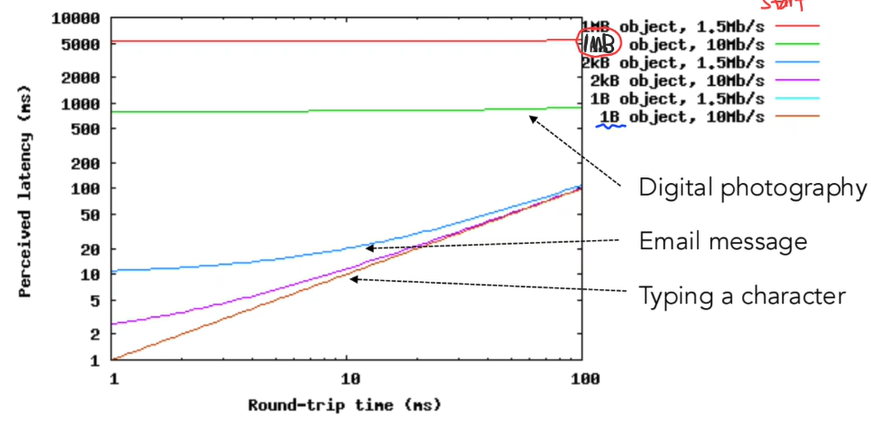
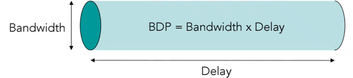
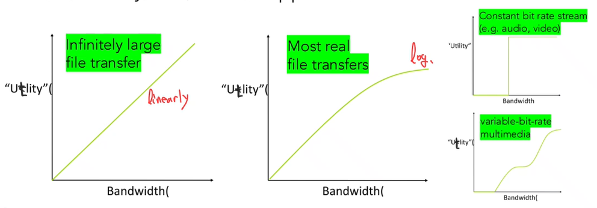

  * 수식이 제대로 보이지 않는다면, 새로고침(F5)을 해주시기 바랍니다.  

## App Performance
Applicaion에서의 Performance를 알아보겠습니다. Performance를 어떻게 평가할 수 있고, performance에 영향을 줄 수 있는 것은 무엇인지 알아봅시다. 

### Perceived Latency
perceived latency: 사용자가 실제로 느끼는 데이터 전송 시간이다. 즉, sender에서 receiver가 데이터를 모두 받을 때까지 걸리는 시간을 의미한다. perceived latency는 throughput과 RTT에 영향을 받는다.  

### RTT
RTT(Round-Trip-Time)은 한 비트(single bit)가 목적지까지 갔다가 다시 돌아오는 데 걸리는 시간을 의미한다.  
Transfer Time: 전송 완료까지 걸리는 시간. Transfer time = RTT + Transmission Delay으로 계산된다.  

### Relation Perceived Latency with RTT

  
위 이미지를 보면, 작은 데이터(1B)는 RTT에 매우 의존적이다. RTT가 증가할수록 Perceived Latency가 비례하며 증가한다.  
큰 데이터(1MB)는 Bandwidth에 의존적이다. 즉, 데이터가 커질 수록 RTT보다는 bandwidth가 전체 지연을 결정한다는 것이다.

### Bandwidth-Delay Product(BDP)
네트워크 안에 동시에 존재할 수 있는 데이터량을 의미하는 것이 BDP이다. 네트워크를 pipe로 생각해볼 때, pipe 안에 동시에 얼마나 많은 데이터가 들어가있을 수 있는 지 생각해보자.  

## Application Requirements
사용자가 앱을 잘 사용하려면 App은 어떠한 요구 사항을 잘 충족해야 사용자에게 만족감을 주는 application이라 할 수 있다. Utility, Burstiness, Jitter, Loss 이렇게 4가지의 관점에서 살펴보자.  

### Utility Function
Utiliy Function: 네트워크 자원이 프로그램의 만족도에 얼마나 기여하는지 나타내는 수학적 함수  

### Burstiness
Burstiness: 데이터가 일정하지 않게 몰리는 특성, 즉 데이터의 흐름이 일관적이지 않고 어느 때는 폭발적, 어느 때는 잠잠한 현상.  
Why this is problem? => 라우터나 스위치의 queue에서 packet loss가 발생할 수 있기 때문!  
Burstiness를 다루기 위한 트래픽 제어 모델: Token buckets, leaky buckets, queueing theory 등...  

### Jitter
Jitter: packet의 end-to-end delay가 일정하지 않은 현상, 즉 패킷 간의 도착 시간이 들쑥날쑥해짐.  
Jitter는 네트워크의 혼잡, queueing delay, routing 등으로 인해 각 패킷의 도착 시간이 달라져서 발생할 수 있다.  
특히 실시간 application(VolP, Game 등)에서는 Jitter 문제가 치명적일 수 있다.  

### Loss
Loss: 일부 패킷이 destination까지 도착하지 못하는 현상. queue에서 overflow로 인해 drop되거나, 전송 중 bit error 때문에 Loss가 발생할 수 있다.  
Loss가 발생한 것을 먼저 detection을 해야하고, 이를 알았다면 correction 혹은 retransmission을 해야 한다.  

---
## **Conclusion**
이번 시간에는 Application Layer의 내용 중 두 번째 파트, Application의 Performance와 관련된 내용을 알아봤습니다.  
