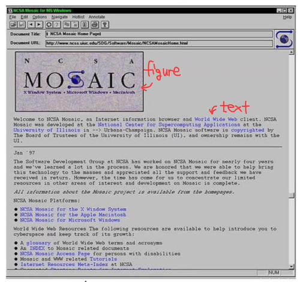
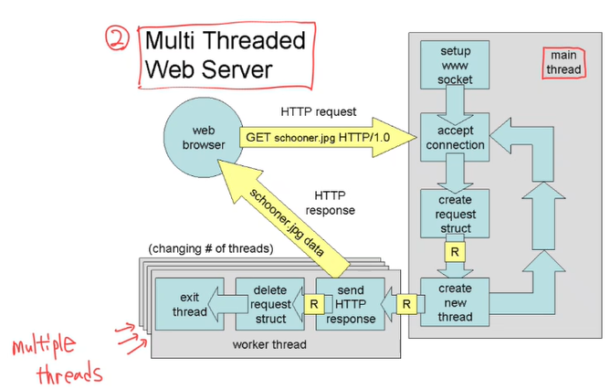

  * 수식이 제대로 보이지 않는다면, 새로고침(F5)을 해주시기 바랍니다.  

이번에는 Application Layer의 내용 중 Web을 중심으로 알아보겠습니다.  

## **Web History**
Web에 대해 자세히 알아보기 전, 먼저 Web의 역사를 알아보겠습니다.  
### Before the 1970s-1980s
Internet은 주로 연구자들과 학계에 의해서만 사용되었음. 오늘날의 웹 페이지를 본다는 개념은 존재하지 않음.  
원격 컴퓨터 로그인, 파일 전송, e-mail 교환 등이 전부였음.  
### Late 1980s and early 1990s
Berners-Lee가 Web을 처음 제안함(1989). 당시 존재했던 Gopher(계층형 메뉴 구조로 문서 탐색), Archie(FTP 서버에서 파일 검색), WAIS(키워드 기반 문서 검색 시스템) 등이 있었지만, 이들은 모두 표준화되지 못하였고 결국 WWW(World Wide Web)이 이 모든 기능을 통합하였다.  
### 1990s
1991: 첫 웹 broser과 server  
1993: Mosaic 브라우저의 첫 버전 등장  


또한 한국에서는 Naver, Daum, YAHOO 등의 Web 1.0이 대세를 이루었다.  
오늘날의 웹은 Web 2.0에 해당하며, 미래의 Web 3.0은 LLM Based가 될 것으로 추측된다.  

## **Web Page**
Web Page는 object들로 구성이 되어있다. object란, 웹 페이지를 구성하는 모든 요소를 의미한다. HTML file, JPEG, PNG, Audio, Video 등이 object에 해당된다. 즉, 웹 페이지는 단일 파일이 아니라 여러 개의 객체로 구성되어 있다는 점을 알아야 한다.  
여러 가지 객체들이 많기 때문에 이를 참조할 중심 틀이 필요한데, 이것이 바로 base HTML-file이다. 이 HTML 파일 안에는 다른 객체(이미지, CSS 등)들을 참조하는 태그들이 들어있다. 아래는 HTML file의 예시이다.  
```html
<html>
  <body>
    <h1>Hello!</h1>
    
    <video src="example.mp4"></video>
  </body>
</html>
```
  
모든 객체들은 URL(Uniform Resource Locator)로 접근할 수 있다. URL은 파일의 위치는 어디있고, 어떻게 가져올 수 있는 지를 명시한 주소이다. 예를 들어 'https://www.someschool.edu/someDept/pic.gif'이다.  

방금 위에서 모든 객체들은 URL로 접근할 수 있다고 하였다. 그런데 URL 뿐만 아니라 URI, URN도 들어본 적이 있을 것이다. URL과는 무슨 차이가 있는 것들일까?  

URI(Uniform Resource Identifier)는 resource를 식별(identify)하는 모든 방법의 총칭을 의미한다. 즉, 단순히 resource를 구별하기 위한 문자열이다. 'https://www.someschool.edu/someDept/pic.gif'라는 주소도 resource를 식별할 수 있기 때문에 URI로 볼 수 있다. URN(Uniform Resource Name)은 resource의 고유 이름이다. 아래 이미지를 보면서 예시로 구별해보자.  


URL 부분을 먼저 보면, 실제 리소스의 위치를 알려주는 부분이다. 즉, 이 resource가 어디에 위치하고 있는지 알 수 있다. URN 부분은 리소스의 이름과 내부 식별자를 포함하고 있다. 그리고 URI는 URL과 URI를 합친 부분임을 확인할 수 있다.  

## **HTTP**
HTTP(HyperText Transfer Protocol): web에서 data를 주고받을 때 사용하는 application layer의 protocol  
HTTP는 Client-Server model 형태이다. Client가 request를 보내고, Server가 Response를 보낸다. client 측에서는 주로 browser가 request, receive, display의 역할을 한다. Server 측에서는 Apache, Nginx 같은 웹 서버 프로그램이 response를 담당한다. Clientrk Firefox browser로 접속하고, Client가 Safari browser로 접속했더라도, HTTP 통신을 하면 결국 같은 프로토콜을 사용한 것이기 때문에 동일한 웹 사이트 동작이 가능하다.  

HTTP는 아래 계층인 Transport Layer의 프로토콜인 TCP를 활용한다. 통신 절차는 다음과 같다.  
1. Client가 TCP 연결을 시작(Socket 생성)  
2. Server가 TCP 연결을 수락  
3. HTTP message를 TCP를 통해 교환: 클라이언트: “GET /index.html HTTP/1.1”, 서버: “HTTP/1.1 200 OK … <html> …” 이런 과정을 반복함.  
4. 데이터 교환이 끝나면 TCP 연결 종료  

HTTP의 매우 중요한 특성이 하나 있는데, 바로 "Stateless"이다. 즉, 상태를 기억하지 않는다는 의미이다. HTTP는 request와 response가 한 쌍으로 끝나는 구조로, server는 client의 과거 request 내용을 기억하지 않는다. 즉, 요청을 받으면 응답을 해주고는 바로 잊는다는 의미이다.  
그런데 우리가 웹에서 로그인을 하면, 일정 시간동안 로그인이 유지가 된다. 이것은 어떻게 가능한 것일까? 이것은 HTTP만으로는 할 수 있는 것이 아니다. Cookie, Session, Token 같은 추가적인 기능을 활용하여 구현한 것이다. 추후 알아볼 예정이다.  
HTTP는 왜 Stateless로 구현이 되었을까? 이렇게 구현하면 서버 입장에서는 구현이 단순하기 때문이다. State를 유지하는 것은 복잡하기도 하지만, 혹시라도 서버가 다운되면 State가 모두 날아가버릴 수도 있다. 따라서 Stateless하게 구현한 후, State가 필요한 곳에는 별도의 기능을 추가해서 쓰는 것이다.  

### HTTP Connections
HTTP에는 두 가지 연결 방식이 존재한다. non-persistent HTTP(=HTTP 1.0)와 persistent HTTP(=HTTP 1.1)가 있다.  
non-persistent HTTP: 하나의 TCP 연결로 하나의 object만 전송하는 방식이다. 즉, 하나의 object를 전송하려면 TCP 연결을 하고, 하나의 object가 전송이 되면 바로 TCP 연결을 종료한다. 그 다음 object를 전송하려면 또 TCP를 연결해야 한다.  
persistent HTTP: 하나의 TCP 연결에 여러 개의 object들을 전송할 수 있다.  
  
### Example
TCP 연결의 단계를 조금 더 자세히 살펴보자. Non-persistent HTTP라고 가정하자. user가 주소창에 URL을 입력한다. 그러면 HTTP client(즉, browser)는 socket을 생성하여 해당 URL 서버의 port 80으로 연결 요청을 보낸다. 서버는 80번 port에서 연결 요청을 기다리고 있다가 이 요청을 받으면 accept를 하고 client에게 연결 완료를 알린다. 이제 연결이 되었으니 client는 server에게 message를 보낼 차례이다. browser는 이제 TCP 연결 위에서 HTTP Message를 보낸다. 서버는 client로부터 메시지를 받았으니, 경로에 해당하는 파일을 찾아 HTTP Response Message를 생성한다. Server는 이 응답을 TCP 연결을 통해 client로 전송한다. 객체 하나의 전송이 끝났으니 이제 TCP 연결이 끝이 나게 된다.  

### Response Time of non-persistent HTTP
non-persistent HTTP에서 response time이 어떻게 될 지 계산해보자. 이전 강의에서 RTT에 대해 알아봤었다. RTT를 활용해보자.  
Client에서 Server로 처음 TCP connection 요청을 보내고 그에 대한 응답을 받는 시간에서 1 RTT만큼 시간 소모가 이루어진다. TCP 연결이 이루어진 다음, Client는 Server에게 필요한 정보를 요청하는 message를 보내고, 그 정보를 server는 Client에게 보내면서 1 RTT + file transmission time만큼 시간 소모가 이루어진다. 따라서 non-persisten HTTP에서 이루어지는 시간은 2 RTT + file transmission time이다.  


그렇다면 여기서 알 수 있는 것은 객체 하나당 최소 2 RTT가 걸리므로, 거리가 멀수록 점점 느려질 수 있다는 문제점이 있다. 이렇듯 non-persistent HTTP의 문제점을 생각해볼 수 있는데, 다음과 같이 정리해볼 수 있다.

### issues of non-persistent HTTP
1. 객체 1개당 최소 2 RTT가 걸림  
2. TCP 연결 오버헤드(OS 부담): 매번 새 socket을 생성하고 닫아야 하기 때문에 CPU와 Memory의 낭비가 발생할 수 있다.  
3. 병렬 연결의 부담: non-persistent HTTP로는 하나의 객체만 주고 받을 수 있기 때문에 빠른 속도를 위해서는 이를 병렬로 연결해야 할 것이다. 이는 역시 네트워크에 부담을 줄 수 있다.  

그렇다면 이번에는 persistent HTTP를 자세히 살펴보겠다.  
persistent HTTP를 사용하면 1번의 TCP 연결 위에서 계속 Object를 전송할 수 있다. 따라서 첫 객체 요청에서만 2 RTT + file transmission time이 소모되고, 이후 객체 요청에서는 계속 1 RTT + file transmission time만 소모된다.  따라서 많은 경우에 persistent HTTP가 효율적일 수 있다. 그러나 persistent HTTP가 안좋은 상황도 물론 있을 수 있다. 예를 들어 Google같은 초대형 서버에서 모든 사용자들과 persistent HTTP를 계속 유지한다는 것은 말도 안되는 일이다. 즉 상황에 따라 연결 방식을 선택하는 것이 중요하다.  

## **HTTP Server Architecture**
HTTP Server 구조를 이제부터 알아보겠다. Single-Threaded Web Server, Multi Threaded Web Server, Thread Pool Web Server가 있다. 아래 그림을 참고하면 쉽게 이해할 수 있다.  


Single-Threaded Web Server에서는 말그대로 thread가 하나기 때문에 하나의 요청이 들어오는 동안 다른 요청이 들어와도 그 요청은 기다리야 한다. 즉, paralell한 방식이 아닌, serial한 방식이다.  



Multi Threaded Web Server에서는 동시에 여러 client의 요청을 병렬로 처리할 수 있다.  


Thread Pool Web Server에서는 요청이 오기 전에 미리 Thread를 만들어 두고 기다린다. 미리 스레드를 준비해두고, 요청이 들어오면 그 중 하나를 사용하는 것이다. Multi Threaded Web Server에서는 요청이 올 때마다 새로 thread를 생성하는 것과 차이가 있다.  
만약 Thread Pool Web Server 방식에서 미리 만들어둔 thread가 4개라고 할 때, 한꺼번에 10개의 request가 들어온다면? 나머지 6개의 request는 queue에 대기하거나 reject될 수 있다.  

## **HTTP Message**
HTTP message에는 request와 response 이렇게 두 종류의 type이 존재한다. 각 타입에 따라 HTTP Message가 어떻게 생겼는지 살펴보자.  
### HTTP Request Message
HTTP request message는 사람이 읽을 수 있는 ASCII 형태로 되어있다. 즉, binary가 아닌 text이다.


첫 줄인 GET~ 부분은 request line이다.  

### HTTP Response Message
이번에는 Response Message를 살펴보자. 첫 줄에는 Response Status Code를 전달한다. 응답 상태가 어떤지를 Client에게 전달하는 것이다.  
200이면 OK, 400이면 Bad Request, 404는 Not Found, 505는 HTTP Version Not Supported를 의미한다. 그 외에도 여러 Code가 있으니 찾아보길 바란다.  


## **Cookies - (1)**
위에서 HTTP는 Stateless이기 때문에 상태를 저장할 수 없다. 따라서 Cookie라는 것을 사용해 상태를 저장할 수 있다.  
Cookie는 사용자 식별 정보를 클라이언트 브라우저에 저장하고, 이후 모든 요청에 자동으로 첨부되어 서버로 전송된다.  
Cookie는 다음과 같은 4가지 구성 요소로 작동한다.  
### Components of Cookies
1. Cookie header line in HTTP response: 서버가 클라이언트에게 쿠키를 보낼 때 사용  
2. Cookie header line in next HTTP request: 클라이언트가 서버에 다시 요청할 때 쿠키를 같이 보냄  
3. Cookie file kept on user’s host: 사용자의 컴퓨터(브라우저)에 저장되는 쿠키 파일. 브라우저가 자동으로 관리함  
4. Back-end database at the website: 서버 측 DB에서 쿠키 ID에 해당하는 사용자 데이터를 저장  

### Example
예를 들어 한 user A가 e-commerce 사이트에 접속했을 때, 서버는 A를 처음 보기 때문에 A의 고유 ID인 userID=12345를 생성한다. 이 ID를 DB에 저장하는 동시에 Set-Cookie 헤더로 이 ID를 Browser에 전달한다.  
```http
HTTP/1.1 200 OK
Set-Cookie: userID=12345
```
다음 요청부터 browser는 자동으로 이 쿠키를 request에 포함시킨다.  
```http
GET /shop/cart HTTP/1.1
Host: www.shop.com
Cookie: userID=12345
```
서버는 “userID=12345”를 보고 Susan의 정보(DB에서 찾기)를 가져온다. 따라서 서버는 이렇게 cookie를 사용하여 state를 유지할 수 있게 된다.  

## **Cookies - (2)**
Cookie의 사용 목적을 다음과 같이 정리해볼 수 있다. 아래의 4가지 외에도 더 있을 수 있다.   
1. Authorization: 로그인 정보 유지
2. Shopping Carts: 장바구니 정보 유지  
3. Recommendations: 사용자 정보 기반 추천  
4. User session State: 세션 유지  

Cookie는 사용자의 정보나 상태에 관한 정보를 담고 있기 때문에, 이것에 해커에게 탈취당한다면 보안 사고로 이어질 수 있다.  

## **Web Caches(Proxy Server)**
Web Caches, 또는 Proxy Server는 서버 대신 응답을 제공하는 중간 저장소이다. 예를 들어, 한국에 있는 client A가 미국에 있는 Server C에 요청을 보내면 이 요청은 Server C로 가기 전에 한국에 있는 Proxy Server에 먼저 전달된다. Proxy에 해당 페이지가 없다면 Proxy Server가 대신 Server C에게 요청을 하고 응답을 받아 A에게 전달한다. 동시에 Proxy Server에 그 응답을 자신의 캐시에 저장한다. 그 다음으로 한국에 있는 client B가 A와 똑같은 요청을 Server C에 요청한다면 그 요청은 Proxy Server에 전달된다. 이제는 Proxy Server가 이 요청을 알고 있기 때문에 Server C로 요청을 보내지 않고 바로 B에게 응답을 전달해준다.  
이 Proxy Server 덕분에 end-to-end delay를 많이 줄일 수 있다.  
<br>
Web Caches의 특성을 보면 Cache는 client이자 Server로 작동할 수 있다는 것을 알 수 있다. 왜냐하면 응답을 받기도 하고, Server에 요청을 보낼 수도 있기 때문이다. 즉, Cache는 중간자인 것이다.  
그러면 이런 Cache는 어디에 있을까? 웹 Cache는 주로 ISP(Internet Service Provider)에 의해 설치가 된다. ISP provider로는 대학, 기업, 가정 ISP(KT, SKT 등)이 있다.  

Web Caching의 장점은 아래와 같이 정리해볼 수 있다.  
1. 사용자는 가까운 캐시 서버에서 응답을 받아 훨씬 빠르게 콘텐츠를 볼 수 있음   
2. 원 서버(특히 해외)로 가는 트래픽을 줄여 네트워크 부하 감소  
3. 캐시 네트워크가 촘촘해지면, 서버 인프라가 약한 중소 콘텐츠 제공자도 전송 효율이 높아짐  

### Example
Web Caching Example과 관련된 계산은 아래 이미지를 참고해보자.  


## **Conditional GET with Web Caching**
Web Cache에 저장된 내용의 버전이 최신이라면, 굳이 원래 서버로부터 정보를 받아서 이를 업데이트 할 필요가 없다. 이 기능이 바로 Conditional GET이다.  
Proxy Server가 Server에 요청을 보낼 때, HTTP 요청 헤더에 'If-Modified-Since: <date>'를 추가한다. 그후 서버로 부터 'HTTP/1.0 304 Not Modified'라는 응답을 받으면 Cache에 있는 내용은 아직 유효하니 계속 사용하면 되는 것이다. 만약 'HTTP/1.0 200 OK, <data>'를 받으면 Cache는 수정되었음을 알고, 변경 사항을 Cache에 저장한다.  

---
## **Conclusion**
이번 시간에는 Application Layer의 내용 중 세 번째 파트, Web과 관련된 내용들을 알아보았습니다.
