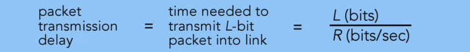
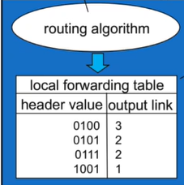
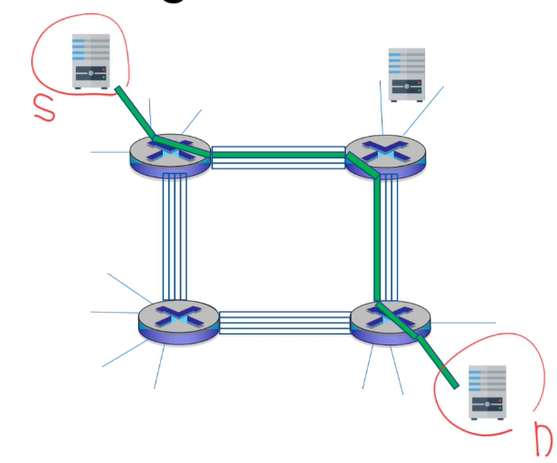
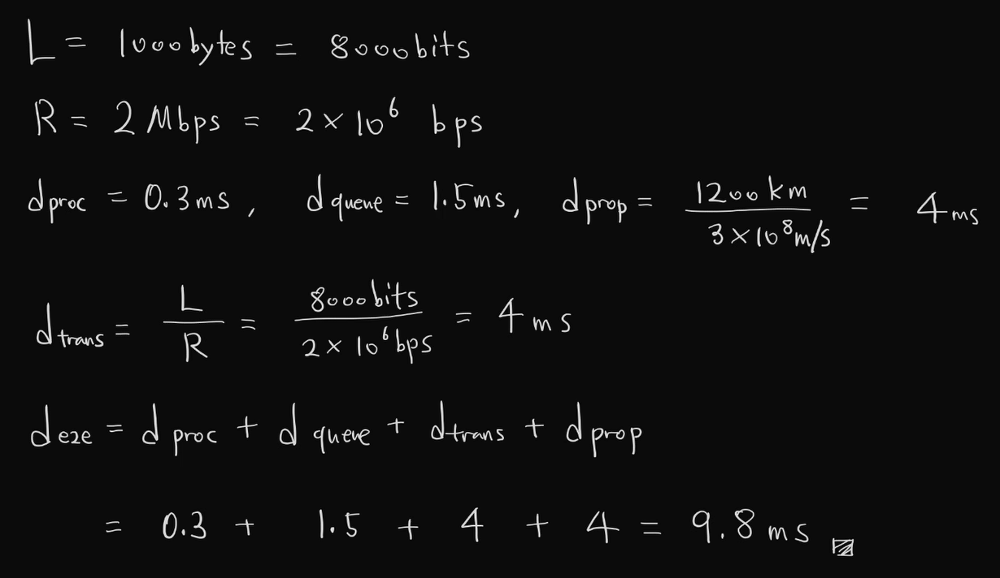

  * 수식이 제대로 보이지 않는다면, 새로고침(F5)을 해주시기 바랍니다.  

## **Communication and Networks**

### definition
Communications: 둘 이상의 개체가 정보를 가지고 소통하는 것  
Computer Communications: 둘 이상의 컴퓨터가 정보(0/1로 구성됨)를 가지고 소통하는 것  

두 개체의 1:1 direct interaction을 communications이라 하고, 여러 개체의 multihop interaction을 networks라고 합니다.  

### Objective of Communications and Networks
1. 가능한 빠르게 정보를 전달하기
2. 가능한 많이 정보를 전달하기
3. 에러 없이 정보를 전달하기

### Elements of Communications and Networks
* Communication Devices  
desktop, home phone, server 등의 stationary devices와 tablet PC, smartphone 등의 mobile devices가 있다.  
  
* Communication Media  
Wired media: twisted pair cable, coaxial cable, optical fiber cable 등이 있다.  
Wireless media: radio waves, microwaves, infrared 등이 있다.  

* Data  
Data: communication devices 간의 정보  
단위로는 Bit, Packet, Frame 등이 있다. data는 analog data와 digital data가 있다.  

* Protocol  
Protocol: 통신을 위한 표준 규약  
e.g. TCP/IP, UDP, LTE, 5G 등  
네트워크에서의 Protocol로 대표적인 것은 OSI 7 Layers이다.  
  
## **Packet Transmission Delay**
Host는 application message를 받아 작은 조각인 packet으로 쪼갠다. packet은 access network로 나간다. 전송률(bit rate, R), 비트 길이(Length, L)일 때, packet trasmission delay는 L(bits)/R(bits/set)로 계산된다.  
  

## **Packet Switching**
Routing: 출발지에서 도착지까지 어떤 route를 따라가야 할 지 결정하는 절차, routing algorithm을 사용함. 그 결과 local forwarding table을 만들어낸다.  

  
Forwarding: packet이 router에 들어왔을 때, header의 목적지 주소를 읽고 해당하는 출력 포트(output link)로 전달하는 과정.  

## **Circuit Switching**
통신을 시작하기 전에, source와 destination 사이에 물리적으로 전용 회선(circuit)을 미리 확보해두는 통신 방식이다. 전통적으로 전화 네트워크에 많이 사용되었다. End-to-End 방식이라 아래 이미지처럼 Source에서 Destination까지 가기 위해서는 처음 노드부터 중간 노드와 도착 노드를 가는 경로 모두 할당을 받게 된다.  
dedicated resources이므로 no sharing이란 특성을 가진다. 따라서 통신 동안 다른 사람이 사용할 수 없기 때문에 효율성이 낮다. 하지만 연결이 보장(guaranteed)된다.  

  
## **Queueing Delay**
host가 네트워크로 packet을 보낼 때, 링크(또는 라우터)의 전송 용량보다 더 많은 패킷이 들어오면 대기열(queue)가 발생하게 된다.  
R: 링크 전송률 (link bandwidth, bits/sec)  
L: 한 패킷의 길이 (bits/packet)  
a: 평균 패킷 도착률(packets/sec) -> 1초에 평균적으로 몇 개의 패킷이 들어오는 지 나타냄.  
  
(1초 동안 도착하는 총 비트 수) = (패킷 당 비트 수) x (패킷 수) = La (bits/sec)  
  
### Traffic intensity
$Traffic\ Intensity = \dfrac{L a}{R}$  
  
La: 초당 queue에 들어오는 데이터의 양(입력 부하)   
R: 초당 처리할 수 있는 양(출력 처리율)  
따라서 traffic intensity의 값이 0에 가까울수록 부하가 거의 없고, 1을 넘어선다면 infinite delay에 걸리게 된다.  
La/R의 값이 1에 갈수록 delay가 급격하게 증가한다!  

### Packet Loss
Packet arrival rate > link capacity인 경우에, queue에 도착 패킷들이 점점 쌓이게 된다. 그러나 queue는 용량 한계가 있기 때문에, 용량이 꽉 찼을 때부터 들어오는 packet은 drop된다. 이것이 packet loss이다.  

## **End-to-End Delay**
패킷이 source에서 여러 라우터를 거쳐서 목적지까지 걸리는 전체 지연 시간을 E2E delay라고 한다.  
  
$$d_{e2e}=d_{proc}+d_{queue}+d_{trans}+d_{prop}$$  
  
Processing delay($$d_{proc}$$): 라우터나 스위치가 packet의 헤더를 검사하고, 목적지 주소 확인 및 비트 오류를 체크하는 데 걸리는 시간.  
Queueing delay($$d_{queue}$$): packet이 라우터의 큐에서 전송 순서를 기다리는 시간.  
Transmission delay($$d_{trans}$$): packet의 모든 비트를 link로 밀어넣는 시간. (= L/R)s  
Propagation delay($$d_{prop}$$): 신호가 medium을 따라 이동하는 시간  

---

## **Practice** 
1. Host A가 라우터 1개를 거쳐 Host B에게 패킷을 보낸다. link의 길이는 1200km이다. 패킷의 크기는 1000bytes, link capacity는 2Mbps이다. 각 라우터의 processing delay는 0.3ms, queueing delay는 1.5ms, 전파 속도는 $$3\times 10^8$$ms로 가정할 때, end-to-end delay를 계산하시오.  

### Answer 

  
<strong>정답 보기</strong>

   
  

  

