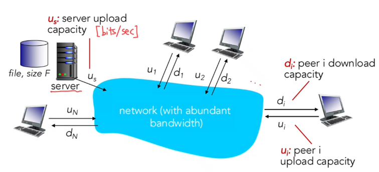
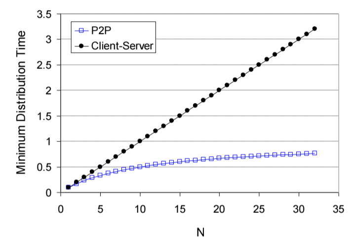
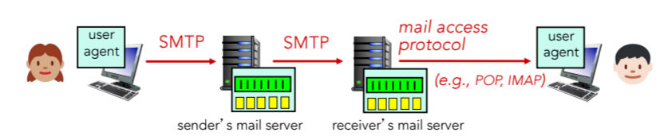
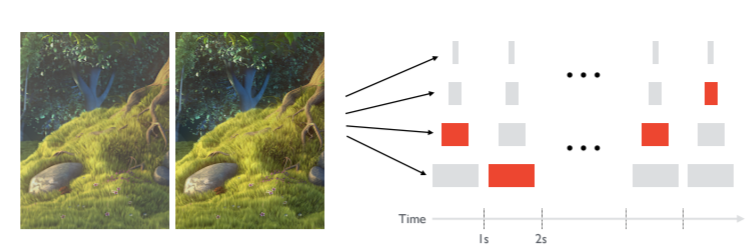

  * 수식이 제대로 보이지 않는다면, 새로고침(F5)을 해주시기 바랍니다.  

## **Application Architecture: P2P**
P2P(peer-to-peer) 방식을 알아보자. 항상 켜져있는 중앙 서버가 없는 구조이다. (no always-on server)  
각 end device들이 직접 통신한다 (directly communication)  
즉, 모든 기기(peer)들이 client이자 server 역할을 할 수 있다.
examples: 파일 공유, 블록체인, torrent  
  
P2P의 중요한 특징으로 self scalability가 있다. self scalability는 새로운 peer가 참가할수록, 서비스 처리 능력(capacity)와 자원(resource)가 함께 증가한다. 즉 확장성(scalability)가 높다. 즉, 새로운 peer가 늘어날수록 네트워크 전체가 커지고 강해지는 것이다.  

## **File Distribution**
파일 사이즈 F bits을 한 server에서 N명의 peers들에게 보내는데 걸리는 시간이 얼마일까? Client-Server구조와 P2P 구조에 따라 파일 전송 시간이 달라지는데 알아봅시다.  

위 상황에서 F bits의 파일을 N명의 Clients에게 전송하려면 시간이 얼마나 걸릴지 알아봅시다.  
  
일반적인 Client-Server 구조라면, 다음과 같이 file distribution time이 결정되게 됩니다.  
  

$$
\displaystyle
D_{c-s}=max(\frac{NF}{u_s},\frac{F}{d_{min}})
$$

앞에서도 다뤘듯, bottleneck때문에, 더 오래 걸린 쪽에 의해 영향을 받게됩니다. 따라서 서버가 NF bits의 파일을 올리는데 걸리는 시간과, 가장 느리게 F bits의 파일을 받는 user의 시간 중 오래 걸린 시간이 file distribution time으로 결정됩니다.  
  
그러면 P2P에서는 어떨까요?  

$$
\displaystyle
D_{P2P}=max(\frac{F}{u_s},\frac{F}{d_{min}},\frac{NF}{(u_s+\sum_{}^{}u_i)})
$$

이렇게 결정됩니다. 첫 번째 부분이 살짝 달라졌는데, 여기는 P2P이기 때문에 서버가 N명에 대한 F bits 파일을 일일이 보낼 필요가 없이 하나만 보내놓으면 유저들이 가져갈 수 있기 때문에 바뀌었습니다. 또한 각각의 client가 파일을 가져가는 시간 또한 $\frac{NF}{(u_s+\sum_{}^{}u_i)}$로 바뀌었습니다. P2P이기 때문에 분모가 다음처럼 바뀐 것은 이해되실 것 같습니다. 중요한 것은 client가 늘수록 분자에 있는 N도 늘겠지만, 분모또한 커지기 때문에 값이 매우 커지진 않을 것이란 점입니다.  
다음 그래프가 P2P의 성능을 나타내며, N이 커질수록 Client-Server 구조보다 P2P에서의 file distribution time이 적게 걸리는 것을 확인할 수 있습니다.  

## SMTP
SMTP(Simple Mail Transfer Protocol)은 email을 전송하기 위해 만들어진 프로토콜입니다. 메일 전송에서 중요한 요소로는 User Agent(UA), Mail Servers, SMTP가 있습니다. User Agent는 말 그대로 mail reader에 해당합니다. 즉 사용자입니다. Mail Server는 메일 박스에 해당합니다. user로부터 메일을 받아서 queue에 저장을 해놓습니다. User Agent인 A가 Mail Server에 메일을 보내게 되면, Mail Server는 다른 Mail Server로 그 메일을 SMTP를 활용하여 보내게 됩니다. 즉, SMTP 프로토콜은 Mail Server간의 통신 방법입니다. 이렇게 메일 서버간 통신이 이루어지면 결국 한 Mail Server로부터 B는 A의 메일을 받을 수 있게 됩니다.  
  

또한 사용자는 POP이나 IMAP과 같은 프로토콜을 활용하여 메일에 접근할 수 있습니다. POP과 IMAP은 Mail Access Protocol에 해당합니다.  

## DASH
이번엔 Video Streaming에 대한 프로토콜인 DASH(Dynamic Adaptive Streaming over HTTP)을 알아보겠습니다. DASH의 풀 네임을 보면, Dynamic하고, Adaptive하다고 하는데요, 이유가 있습니다.  
실제로 Internet에는 Video traffic이 매우 많은 bandwidth를 사용하기 때문에 이 Video를 어떻게 효율적으로 잘 전송하는지가 매우 중요합니다. txt파일이나 이미지보다는 Video가 용량이 압도적으로 크기 때문이죠.  
수많은 User들은 다양한 환경에서 인터넷 동영상을 시청할 수 있습니다. 즉, 누구는 인터넷 환경이 좋을 수도 있지만 그렇지 않은 User도 있을 수 있다는 의미입니다. 또한 User의 수가 갑자기 늘어날 수도 있습니다.  
어렵게 말하면 Video Streaming에서는 Scalability와 Heterogeneity를 고려해야 합니다. 쉽게 말하면, 수많은 사용자들이 다양한 환경에서 접속해도 Video Streaming이 잘 되도록 만들어야 한다는 것입니다.  

그렇다면 이를 위해 Video를 어떻게 전송을 해야할까요? 위 문제점을 다룰 수 있는 방법으로 두 가지를 이야기해볼건데요, 첫 번째는 Video Encoding을 효율적으로 하는 것입니다. 즉, 전송할 파일 자체를 작게 만들면 되는 것이죠.  
Spatial Encoding과 Temporal Encoding을 사용할 수 있습니다. Video나 이미지 특성 상, 인접한 픽셀은 거의 색이 같기 때문에 크게 차이를 둘 필요가 없습니다. 따라서 '인접한 정보를 한꺼번에 묶어 보내면 모든 픽셀에 대한 정보를 보내는 것보다 효율적이지 않을까?'라는게 Spatial Encoding입니다.  
Temporal Encoding은 시간 간격이 적으면 차이가 거의 없음을 이용한 Encoding 방식입니다. 예를 들어 동영상에서 5초 시점과 5.0001초 시점은 거의 차이가 없겠죠?  
  
이렇듯 Encoding을 효율적으로 하여 파일 자체의 크기를 줄이는 것이 1번 째 방법이라면, 두 번째로는 효율적으로 전송하는 것입니다. 이를 위한 프로토콜이 바로 DASH입니다.  
  
DASH가 어떤 프로토콜인지 알아보겠습니다. Server는 Video를 한번에 보내지 않습니다. 여러 개의 Chunk단위로 쪼개서 보내게 됩니다. 각각의 chunk마다 다른 속도로, 다른 quality로 인코딩됩니다. 또한 각각의 chunk마다 고유의 URL을 갖습니다.  
Client는 이러한 chunk를 순서대로 전송받게 됩니다. 이 때 client는 자신의 네트워크 환경에 맞는 chunk를 전송받게 됩니다. 즉, 현재 bandwidth에서 가장 지속가능하면서도 최대의 속도인 chunk를 전송받습니다. 이렇게 때문에 앞서 설명드렸던 Video 전송 문제에 유용한 역할을 할 수 있습니다.  

## CDN
DASH만으로는 수천, 수억 명의 User에게 동시에 Video Streaming하는 것에 한계가 있습니다. Video를 쪼갠 chunk들을 저장할 곳이 필요하기 때문에 매우 많은 서버들이 필요할 것인데, 이렇게 많은 user를 모두 수용하려면 어떻게 해야할까요? 첫 번째는 단순 무식하게(?) 하나의 큰 MEGA 서버를 짓는 것입니다. 하지만 서버 하나 자체를 크게 만드는 것은 위험할 수 있습니다. 만약 그 서버가 마비가 되면, 수많은 user가 피해를 볼 수 있겠죠. 전지구적인 Video 마비 현상이 일어날 것입니다. 또한 이렇게 짓는 것은 효율도 안좋습니다. 그렇다면 어떻게 해야할까요?  
바로 CDN(Content Distribution Network)를 활용하는 것입니다. 세계 여러 군데에 chunk를 저장할 수 있는 서버를 짓는 것이죠. 그렇다면 User는 가까운 서버에서 데이터를 받을 수 있으니 속도도 빠를 것입니다. 여담으로 Akamai, Limelight 등의 CDN 전문 회사도 존재합니다. 관심 있으신 분들은 찾아보시길 바랍니다.

---
## **Conclusion**
이번 시간에는 P2P의 구조 및 장점, 그리고 Application Layer의 프로토콜 중 SMTP와 DASH, 그리고 CDN에 대해 알아보았습니다.  
