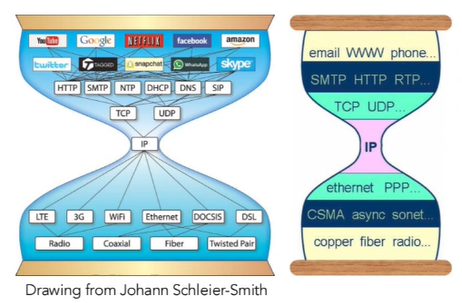

  * 수식이 제대로 보이지 않는다면, 새로고침(F5)을 해주시기 바랍니다.  

이번 내용에서는 인터넷의 역사를 알아보겠습니다. 연도 별로 중요한 내용을 정리하였으니 참고하시길 바랍니다.  

## **Early Packet-Switching Princples (1962-1972)**

### 1961
- Leonard Kleinrock이 queueing theory를 통해 packet switching의 효율성을 수학적으로 증명함.  
- Kleinrock은 Father of Internet이라 불림  

### 1964
- Paul Baran이 군용 통신망(military nets)에 packet switching을 적용하는 아이디어 제시

### 1967
- ARPAnet이 구상됨 by ARPA(Advanced Research Projects Agency)  

### 1969
- ARPAnet의 탄생(처음은 4개의 노드로 시작됨: UCLA-SRI-UCSB-Utah)  

### 1972
- ARPAnet public demo  
- 첫 host-to-host 프로토콜 => NCP(Network Control Protocol)  
- first e-mail program  
- ARPAnet이 15개의 노드를 가짐  

## **Internetworking, new and proprietary nets (1972-1980)**
이 시기는 여러 개의 독립된 네트워크들을 하나로 연결(interconnect)하기 위한 기술적, 철학적 기반이 형성되던 시기이다.  

### 1970
- ALOHAnet satellite network 탄생: wireless connection  

### 1974
- Cerf와 Kahn이 Interconnecting Networks 아키텍쳐를 제안함 => 오늘날 인터넷의 어원이 됨  

### **Cerf and Kahn's internetworking principles**
1. Minimalism & Autonomy: 네트워크 내부 구조를 바꾸지 않고도 연결 가능해야 한다.  
2. Best-effort Service Model: 모든 패킷의 전달을 보장하진 않더라도 가능한 최선을 다해 전달해야 한다.  
3. Stateless Routers: 라우터는 각 패킷을 독립적으로 처리한다.  
4. Decentralized Control: 분산 제어 방식(not centralized way)  

### 1776
 - Ethernet 등장 at Xerox PARC  

### Late70s
- 여러 기업들이 자체적, 상업적인 네트워크 프로토콜을 제작함: DECnet, SNA, XNA => 그러나 서로 호환되지 않음  
- 고정된 길이의 packet을 사용하는 switching network가 등장함 => 이후 ATM(Asynchronous Transfer Mode) 기술로 발전  

### ATM v.s. Internet

| 구분                    | **ATM (Asynchronous Transfer Mode)** | **Internet (TCP/IP)**       |
| ----------------------- | ------------------------------------ | --------------------------- |
| **속도(Speed)**         | 빠름 (Fast)                          | 상대적으로 느림 (Not fast)  |
| **품질보장(QoS)**       | 전송 품질이 보장됨 (Guaranteed QoS)  | Best-effort 방식, 보장 없음 |
| **비용(Cost)**          | 구축 및 운영 비용이 높음 (Expensive) | 비교적 저렴 (Not expensive) |
| **구조(Architecture)**  | 중앙집중형 (Centralized)             | 분산형 (Distributed)        |
| **확장성(Scalability)** | 제한적                               | 매우 높음                   |
| **유연성(Flexibility)** | 낮음 (고정 길이 셀)                  | 높음 (가변 길이 패킷)       |
| **대표적 사용처**       | 전용망, 기업용 통신                  | 전 세계 공용 인터넷         |
  
=> 유연성, 확장성, 비용 효율성, 그리고 분산 제어 구조 덕분에 개방형 Internet 아키텍처가 폐쇄적 ATM 네트워크를 대체하게 됨.  

### 1979
- ARPAnet이 200개의 노드를 가짐  

## **New protocols, a proliferation of networks (1980-1990)**
이 시기는 인터넷 표준 프로토콜들이 완성되고, 네트워크가 폭발적으로 확산되던 시기이다.  

| 연도     | 프로토콜                                 | 내용                                                                     |
| -------- | ---------------------------------------- | ------------------------------------------------------------------------ |
| **1982** | **SMTP (Simple Mail Transfer Protocol)** | 전자메일 전송 규약. 인터넷 상에서 이메일 송수신이 가능해짐.              |
| **1983** | **TCP/IP Deployment**                    | ARPAnet이 TCP/IP로 완전히 전환 → 오늘날의 인터넷 출발점.                 |
| **1983** | **DNS (Domain Name System)**             | 도메인 이름을 IP 주소로 변환. 사람이 읽기 쉬운 주소 체계 도입.           |
| **1985** | **FTP (File Transfer Protocol)**         | 네트워크를 통해 파일 송수신을 가능하게 한 프로토콜.                      |
| **1988** | **TCP Congestion Control**               | 네트워크 혼잡(패킷 정체) 문제를 해결. 인터넷 안정성 확보 (Van Jacobson). |

또한 새로운 국가 단위의 네트워크(national netwoks)가 등장하고, 점차 네트워크 연합체(Confederation of Networks)를 형성하기 시작했다. (이 시점에 이미 10만 개 이상의 Hosts들이 연결되어 있었다.)  

  
## **Commercialization, Web, Apps (1990s-2000s)**
인터넷이 연구용 네트워크에서 상업화(Commercialization) 되고, 웹(Web) 과 새로운 응용 프로그램(new apps) 들이 폭발적으로 등장한 시기이다.  

| 연도            | 사건                                         | 내용                                                                     |
| --------------- | -------------------------------------------- | ------------------------------------------------------------------------ |
| **Early 1990s** | **ARPAnet 종료 (Decommissioned)**            | 인터넷의 시초였던 ARPAnet이 역사 속으로 사라짐.                          |
| **1991**        | **NSFNet 상업화 허용**                       | 미국 국립과학재단(NSF)이 상업적 사용 제한을 해제함 → 인터넷 상업화 시작. |
| **1990**        | **HTML, HTTP 제안 (Tim Berners-Lee)**        | 하이퍼텍스트 기반 웹 기술 제안 → 웹의 기술적 토대 마련.                  |
| **1994**        | **Mosaic 브라우저 등장**                     | 최초의 그래픽 웹 브라우저 → 이후 Netscape로 발전.                        |
| **Late 1990s**  | **웹 상업화 (Commercialization of the Web)** | 전자상거래, 포털, 검색엔진 등 다양한 웹 비즈니스 출현.                   |

### Later 1990s-2000s

- Killer Apps 등장: 인스턴트 메신저, P2P 파일 공유, 이메일, 웹 포털 등  
- 네트워크 보안(Network Security) 이 주요 이슈로 부상  
- 규모 성장: 약 5천만 호스트(Hosts), 1억 명 이상의 사용자(Users)  
- 백본 속도(Backbone Speed): Gbps 단위의 고속 네트워크 링크 도입  
  
## **Thesedays (2005-present)**

| 구분                                | 내용                                                                                           |
| ----------------------------------- | ---------------------------------------------------------------------------------------------- |
| **디바이스 확산**                   | 2016년 기준 약 **50억(5B)** 개의 기기가 인터넷에 연결됨 (스마트폰, 태블릿 중심).               |
| **브로드밴드 보급**                 | 초고속 유선 및 무선 인터넷이 전 세계적으로 급격히 보급됨.                                      |
| **고속 무선 접속의 일상화**         | Wi-Fi, LTE, 5G 등 무선 인터넷이 언제 어디서나 가능해짐.                                        |
| **온라인 소셜 네트워크의 등장**     | Facebook, Twitter, Instagram 등 플랫폼을 통해 전 세계가 연결됨.                                |
| **클라우드 서비스의 확산**          | Amazon EC2, Google Cloud, Microsoft Azure 등 클라우드 기반 서비스가 표준이 됨.                 |
| **서비스 제공자의 독립 네트워크**   | Google, Microsoft 등은 자체 네트워크를 구축하여, 검색·이메일·동영상 서비스에 즉각적 접근 제공. |
| **e-Commerce와 데이터 경제의 성장** | 대학, 기업, 쇼핑몰 등이 모두 클라우드 기반 시스템으로 전환함.                                  |

---
## **Conclusion**
지금까지 인터넷의 역사를 시간 순으로 알아보았습니다.  
