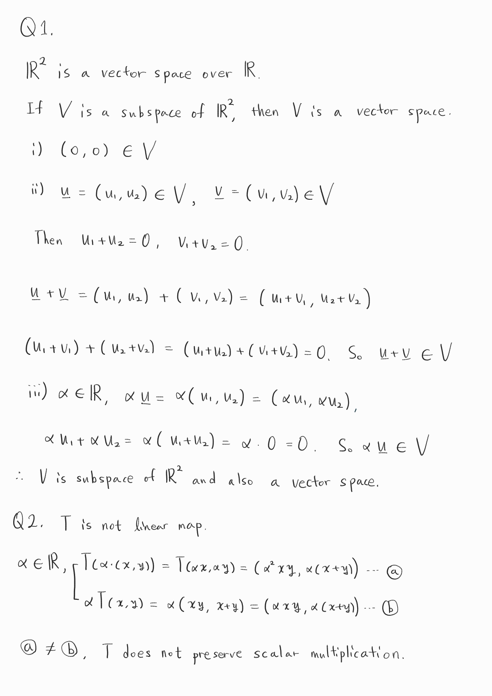

  * 수식이 제대로 보이지 않는다면, 새로고침(F5)을 해주시기 바랍니다.  
  
  
 이번 글을 시작으로 하여, 선형대수학을 다룰 예정입니다.
 참고 교재는 Linear Algebra: A Modern Introduction(Poole, David)입니다.

  ※선행 지식 
 선형대수학 챕터는 고등학교 수준의 벡터의 개념과 행렬의 사전 지식을 알고 있다고 가정하고 설명합니다. 
 1. 벡터의 개념 및 연산(덧셈, 내적)
 2. 행렬의 개념 및 연산(덧셈, 곱셈, 전치)
  
위 목록의 선행 지식을 모두 알고 글을 읽으시는 것을 추천드립니다.

이번 글은 vector space에 대해 깊게 파보려고 합니다. 처음 글에서 다룰 내용은 Field인데요, 사실 컴퓨터 과학에 필요한 선형대수학치고는 조금 내용이 과할 수는 있으나, 알면 벡터 공간에 대한 이해에 도움이 되어 다루었습니다. 

## Field
Field($F$)는 연산이 정의된 집합입니다. 체(field)는 아래의 조건을 모두 만족하는 대수구조입니다. 
1. $a+b=b+a$ (덧셈에 대한 교환법칙)
2. $a\cdot b=b\cdot a$  (곱셈에 대한 교환법칙)
3. $a+(b+c)=(a+b)+c$  (덧셈에 대한 결합법칙)
4. $(a\cdot b)\cdot c=a\cdot (b\cdot c)$  (곱셈에 대한 결합법칙)
5. $a(b+c)=ab+ac$, $(a+b)c=ac+bc$  (분배법칙)
6. $0+a=a$, $0\in F$  (덧셈에 대한 항등원)
7. $1a = a$, $1\in F$  (곱셈에 대한 항등원)
8. $a+(-a)=0$, $-a\in F$  (덧셈에 대한 역원)
9. $aa^{-1}=1$, $a^{-1}\in F$  (곱셈에 대한 역원)

field의 예시는 아래와 같습니다. 모두 흔히 보던 것들이죠? 
$\mathbb{Q}$: set of quotients (유리수체, 유리수집합)  
$\mathbb{R}$: set of real numbers (실수체, 실수집합)  
$\mathbb{C}$: set of complex numbers (복소수체, 복소수집합)

그 외에 $\mathbb{Z}_p$ (p is prime number)도 field인데요, 궁금하신 분은 찾아보시길 바랍니다. 
체에 대한 더 자세한 설명은 [위키백과의 Field (mathematics) 문서](https://en.wikipedia.org/wiki/Field_(mathematics))를 참고하세요. 

## Vector Space
앞으로 벡터 공간(Vector Space)를 계속 다룰 것입니다. Vector Space란, 체($F$) 위에서, 덧셈과 스칼라 곱이라는 연산이 정의되고, 덧셈 연산의 공리와 스칼라 연산의 공리를 만족하는 집합 $V$입니다. 
말이 어려운데요, 요약하자면, 아래 조건을 모두 만족하는 집합 $V$는 vector space입니다.
1. 덧셈에 대한 항등원, 역원이 존재한다.
2. 곱셈에 대한 항등원이 존재한다.
3. 교환법칙, 결합법칙, 분배법칙이 성립한다.  
  
이 법칙들은 field 조건에서도 수식적으로 다루었기 때문에 생략하겠습니다. 또한 항등원과 역원에 대한 이해가 더 필요하시다면 추가로 정보를 찾아보시는 것을 추천합니다.

## Subspace
이번에는 부분공간(Subspace)에 대해 알아보겠습니다. 특히 우리는 벡터 공간을 주로 다룰 것이므로 $V$가 vector space일 때, $S$가 $V$의 subspace임을 어떻게 표현하는지 알아봅시다. 
아래 세 가지 조건을 만족할 때, $S\subseteq V$라고 합니다. 
1. $\textbf{0} \in S$
2. $S$ is closed under addition: $\textbf{x},\textbf{y}\in S $ implies $\textbf{x}+\textbf{y}\in S$
3. $S$ is closed under scalar multiplication: $\textbf{x}\in S, \alpha\in F$ implies $\alpha\textbf{x}\in S$   

 예를 들어 설명해보겠습니다. $V=\mathbb{R}^{2}$일 때, $S=\{(x,y)\in \mathbb{R}^{2}:x+y=3\}$는 subspace가 아닙니다. 그 이유는 $\textbf{0}\notin S$이기 때문입니다. 
반면 $S=\{(x,y)\in \mathbb{R}^{2}:x+y=0\}$는 $V$의 subspace입니다. 위 세 조건을 모두 만족하기 때문입니다. 아래의 연습 문제를 통해 직접 증명해보시길 바랍니다. 

## Linearity
선형대수학에서 가장 중요한 개념인 선형성(Linearity)입니다. 직선과 비슷한 성질을 가질 때 선형성을 갖는다고 말합니다. 굉장히 추상적으로 보일 수 있는데요, 수학에서의 선형성의 정의는 아래와 같습니다.  

함수 $f$에 대하여 Additivity와 Homogeneity가 만족할 때,
1. $f(x+y)=f(x)+f(y)$  (Additivity)
2. $f(\alpha x)=\alpha f(x)$  (Homogeneity)
  
함수 $f$는 linear합니다.

## Linear Map
이번에는 linear map을 다루겠습니다. 두 벡터 공간 사이의 함수가 바로 linear map입니다. 정의는 아래와 같습니다.

A linear map is a function $T : V\to W$, where $V$ and $W$ are vector spaces,  
(i) $T(\textbf{x}+\textbf{y})=T(\textbf{x})+T(\textbf{y})$ $\forall \textbf{x},\textbf{y} \in V$ 
(ii) $T(\alpha \textbf{x})=\alpha T(\textbf{x})$ $\forall \textbf{x}\in V, \alpha \in \mathbb{R}$ 

 
linear map은 vector addition과 scalar multiplication을 만족하는 함수이며, 위 조건을 만족하는 $T$를 선형 사상이라고 합니다. 
행렬은 대표적인 linear map입니다! 행렬 $A \in R^{m\times n}$는 $T:\mathbb{R}^{n}\to \mathbb{R}^{m}$를 표현합니다. 
예시를 들어 설명하겠습니다. 다음과 같은 행렬이 있다고 해봅시다. 

$$
\displaystyle
A = \begin{bmatrix} 1 & 2 \\ 0 & -1 \end{bmatrix}, \quad 
\mathbf{x} = \begin{bmatrix} x_1 \\ x_2 \end{bmatrix}
$$

 
이때, $T(\mathbf{x})$를 계산하면 다음처럼 됩니다. 

$$
\displaystyle
T(\mathbf{x}) = A\mathbf{x} = 
\begin{bmatrix}
1 \cdot x_1 + 2 \cdot x_2 \\
0 \cdot x_1 - 1 \cdot x_2
\end{bmatrix}
=
\begin{bmatrix}
x_1 + 2x_2 \\
- x_2
\end{bmatrix}

$$

 
즉 $\mathbf{x}$는 $A$로 인해 선형 변환되었습니다. additivity와 homogeneity도 만족합니다.

## **Conclusion**
이번 시간에는 vector space를 이해하기 위해 field 조건을 먼저 알아보았습니다. 그리고 vector space의 정의와 linearity의 정의를 알아보았습니다. 또한 linear map을 이해하고, 행렬은 선형사상을 구체적으로 표현하는 도구임을 알아보았습니다. 
이번 시간의 내용은 선형대수학의 기초이며, 반드시 알아야 하는 중요한 개념입니다. 꼭 이 내용에 대한 숙지를 하시면 좋겠습니다. 아래 연습 문제를 통해 본 포스팅의 내용을 잘 이해하셨는지 확인해보시길 바랍니다.

## **Practice** 
Q1. $V$가 vector space인지 여부를 판별하고, 그 이유를 서술하시오.

$$
\displaystyle
V=\{(x,y)\in \mathbb{R}^{2}:x+y=0\}
$$

 
Q2. $T(x,y)=(xy,x+y)$일 때, $T:\mathbb{R}^2\to \mathbb{R}^2$가 linear map인지 여부를 판별하고, 그 이유를 서술하시오. 

### Answer

  
<strong>정답 보기</strong>

   
  

