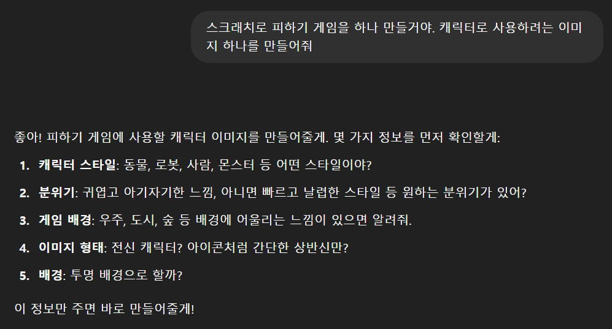
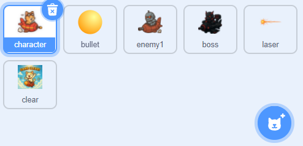
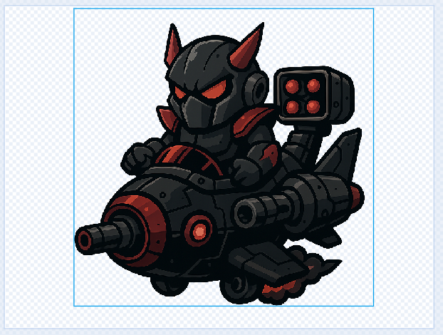
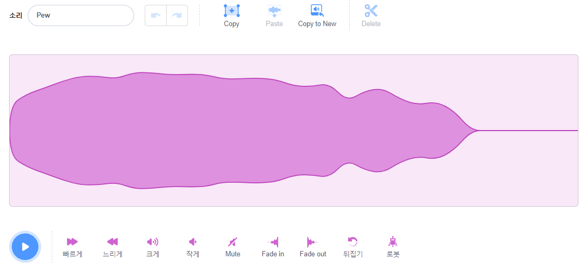

## Introduce
2025년 7월 5일, 고려대학교에서 '모두의 모두의 SW·AI 캠프: 마이크로비트를 통해 배우는 피지컬 컴퓨터 프로그래밍'를 진행하였습니다. 본 포스팅은 강의에서 활용한 '장애물 피하기 게임'과 '고양이 대모험'에 대한 추가 설명 및 링크입니다. 아래에 코드가 있으니 참고하시면 됩니다! 또한 바로 게임을 해볼 수 있도록 해두었습니다!

## '고양이 대모험' 살펴보기
'고양이 대모험'은 Scratch에도 업로드 해 두었으니 직접 코드를 확인하시거나, 다운 받아서 플레이하실 수도 있습니다! 
본 포스팅에서는 어떻게 '고양이 대모험'을 제작했는지를 간단하게 다루겠습니다. 
  
'고양이 대모험'을 기획한 과정부터 설명을 드릴게요. '짧은 시간 내에 전투감있고 몰입이 되는 게임을 만들 수는 없을까?'를 고민하다가, 슈팅 게임 장르로 결정하게 되었습니다. 
귀여운 캐릭터(특히 제가 좋아하는 고양이)가 비행기를 타고, 적 로봇들을 격추시키는 공중전을 표현하였습니다. 
일단 기획은 이런 식으로 진행했어요!  
다음으로, 제작 과정을 소개하겠습니다. 
먼저 고양이 캐릭터와, 적, 배경 등의 이미지가 필요했는데요, 요새 ChatGPT가 이런 것도 잘 하는 것 같아서 image generator를 활용했습니다. 

 

그 결과 아주 만족스러운 스프라이트용 에셋을 얻을 수 있었습니다! (여기서 bullet은 scratch 자체의 Ball 스프라이트의 이름을 bullet으로만 바꾸긴 했습니당.) 

 

이 게임에서는 캐릭터가 비행선을 타고있기 때문에 위, 아래로 움직이도록 구현했습니다. 그리고 마이크로비트의 A버튼을 누르면 비행선이 상승하고, 가만히 있으면 저절로 중력때문에 비행선이 하강하도록 구현했습니다. 
중력을 엄밀하게 구현하진 않았고, 그냥 그럴싸한 정도만 구현했습니다...ㅎㅎ 
 
보스 이미지가 생각보다 잘 뽑혀서 만족스러웠습니다...! 보스는 레이저를 쏴서 플레이어를 직접 공격하도록 구현했어요. 

 
 
마지막으로 효과음 관해서 설명드리고 싶었는데요, 실제 scratch에서 지원하는 효과음이 생각보다 많습니다! 다만 이걸 그대로 가져다 쓰기에는 상황에 어울리지 않는 경우가 종종 있어요. 
그래서 저는 scratch 소리 중 괜찮아 보이는 것을 일단 가져온 다음에, fade-in, fade-out을 조절하거나 소리의 재생속도를 조절하여 소리 자체를 편집했습니다! 
이렇게 하면 다소 하이톤의 소리도 중저음+무거운 느낌을 줄 수도 있어요. 

 

코드를 직접 보고 싶으시거나, 게임을 플레이해보고 싶으시다면 아래 링크를 이용하세요! 

  🎮 <strong>스크래치 게임:</strong>
  <a href="https://scratch.mit.edu/projects/1191783019/" target="_blank" rel="noopener noreferrer">
    클릭해서 직접 플레이해 보세요!
  </a>

## Microbit 장애물 피하기 게임 코드 살펴보기

아래는 장애물 피하기 게임의 코드 블록입니다. (똥피하기 게임 그거 맞습니다, 네) 

<iframe style="position:absolute;top:0;left:0;width:100%;height:100%;" src="https://makecode.microbit.org/---codeembed#pub:S55220-75214-92373-16338" allowfullscreen="allowfullscreen" frameborder="0" sandbox="allow-scripts allow-same-origin"></iframe>

 

## 장애물 피하기 게임 해보기

  <iframe style="position:absolute;top:0;left:0;width:100%;height:100%;"
          src="https://makecode.microbit.org/---run?id=S55220-75214-92373-16338"
          allowfullscreen
          sandbox="allow-popups allow-forms allow-scripts allow-same-origin"
          frameborder="0">
  </iframe>

## 마무리
추후 업로드 예정

