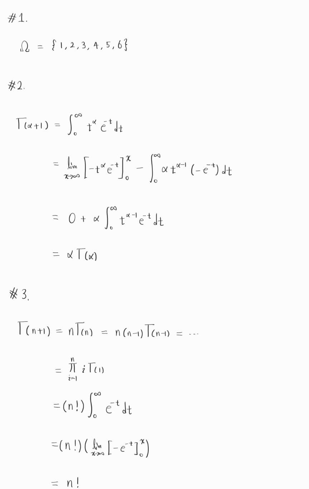

  * 수식이 제대로 보이지 않는다면, 새로고침(F5)을 해주시기 바랍니다.  
  
  
 이번 글을 시작으로 하여, 통계학에 필요한 기초 확률 이론을 다룰 예정입니다.
 참고 교재는 Statistical Inference(George Casella, Roger L. Berger)입니다.

 ※선행 지식 
 확률 이론 챕터는 기본적인 선형대수학과 미적분의 개념을 필요로 합니다. 고등학교 미적분과 저의 선형대수학 강의 내용을 이해하신 후 '확률 이론' 포스팅을 보시는 것을 권장드립니다. 
 1. 벡터와 행렬
 2. 함수의 극한
 3. 미분과 적분

 이번 글은 앞으로 공부할 확률 이론을 이해하기 위해 필요한 사전 지식을 간단히 정리하였습니다.

## **Probability Space**
확률을 정의하기 위해서는 다음 세 용어의 정의를 정확히 이해하고 넘어가는 것이 중요합니다.
1. outcome : experiment가 수행되었을 때 나오는 결과
2. Sample space($\Omega$) : 모든 가능한 outcome들의 집합
3. event : experiment에서 가능한 outcome들의 부분 집합, $A = \\{ \omega \in \Omega \\} \subseteq \Omega$로 표기할 수 있습니다. 

동전 던지기를 예로 들어보겠습니다. 동전을 던졌을 때, 나올 수 있는 outcome은 앞면(H)과 뒷면(T) 두 가지입니다.  
Sample space는 $\Omega = \\{ H, T \\}$ 입니다.  
앞면이 나온다(A)라는 사건은 $A = \\{ H \\}$, 뒷면이 나온다(B)라는 사건은 $B = \\{ T \\}$가 됩니다.  

추가로, event A에 대한 확률은 $\mathbb{P}(A)$라고 표현합니다.

## **Set Theory**
 집합은 확률을 이해하는 데 매우 중요한 개념입니다. 집합에 대한 자세한 설명은 생략하되, 확률 이론 공부를 위해 필요한 집합의 성질을 설명하겠습니다. 혹시 집합에 대해 잘 모르신다면, 간단하게 집합에 대한 공부를 하신 후 본 포스팅을 읽으시는 것을 추천드립니다.

 $a \in A$ : a가 집합 A의 원소(element)이다.  
 $A \subseteq B$ $\Longleftrightarrow$ ($x \in A \Longrightarrow x \in B$) : A는 B의 부분 집합이다. (containment)

### Elementary Set Operations
  1. Union : $A \cup B$
  2. Intersection : $A \cap B$
  3. Complementation : $A^c$
  4. Difference : $A - B$

### Properties of Set Operations
  1. Commutativity : $$A \cup B = B \cup A$$
  2. associativity : $(A \cup B) \cup C = A \cup (B \cup C)$
  3. distributivity : $A \cap (B \cup C) = (A \cap B) \cup (A \cap C)$
  4. DeMorgan's Laws : $(A \cup B)^c = A^c \cap B^c$

### Disjoint
$A \cap B = \emptyset$인 경우, 두 event인 A, B는 disjoint하다고 합니다. 
만약 event가 $A_1, A_2, ..., $ 이렇게 3개 이상인 경우에는 $A_i \cap A_j = \emptyset$  $\forall_i \forall_j$  $i \neq j$를 만족하면 $A_1, A_2, ...$는 pairwise disjoint하다고 합니다.
또한 두 경우 모두에 mutually exclusive라는 표현을 쓸 수 있습니다.

### Inclusion-Exclusion rule

$$
\displaystyle
\mathbb{P}(A\cup B)=\mathbb{P}(A)+\mathbb{P}(B)-\mathbb{P}(A\cap B)
$$

## **Binomial Theorem**
다음은 이항 정리는(Binomial Theorem)입니다. 이항 정리는 확률과 통계 시간에 배우셨을텐데요, 앞으로도 계속 쓰일 내용이니 한 번 정리를 하고 넘어갈 필요가 있습니다.  

$$
\begin{aligned}
\text{Binomial Theorem:} \quad
(a + b)^n 
&= \sum_{k=0}^{n} \binom{n}{k} a^k b^{n - k} \\
&\text{for any real numbers } a, b \text{ and integer } n \ge 0.
\end{aligned}
$$

다항식 $(x+1)^{n}$의 계수를 결정할 때 주로 사용하셨을텐데요, 앞으로 다룰 내용에도 이 이항 정리를 활용한 증명이 자주 등장할 예정이니 꼭 기억해두시길 바랍니다.

## **Gamma Function**
Gamma function은 factorial을 확장한 함수입니다. factorial이 이번 확률 이론에서 중요한 것은 아니지만, 이후에 적분 계산을 할 때 gamma function을 이용하면 계산을 매우 간단하게 할 수 있기 때문에 이 단계에서 소개하겠습니다.  
감마 함수는 다음과 같이 정의됩니다.

$$
\displaystyle
\Gamma(\alpha)
=
\int_{0}^{\infty} t^{\alpha-1} e^{-t}\,dt
$$

### Properties of gamma function
1. $\Gamma(\alpha+1)=\alpha\Gamma(\alpha)$  
2. $\Gamma(n+1)=n!$ $(n \in \mathbb{N})$
3. $\Gamma(\frac{1}{2})=\sqrt{\pi}$  

위의 세 성질 또한 감마 함수를 이용한 계산에서 매우 유용하므로 기억해두는 것이 좋습니다! 3번 성질에 대한 증명은 이후에 다룰 것이고, 1번과 2번에 대한 증명은 연습 문제를 통해 직접 증명해보시길 바랍니다.

## **Practice** 
1. 주사위를 던지는 experiment를 할 때의 sample space를 집합으로 표현하시오.
2. $\Gamma(\alpha+1)=\alpha\Gamma(\alpha)$ 임을 증명하시오.
3. $\Gamma(n+1)=n!$ $(n \in \mathbb{N})$ 임을 증명하시오.  
  
  
  

### Answer 

  
<strong>정답 보기</strong>

   
  

