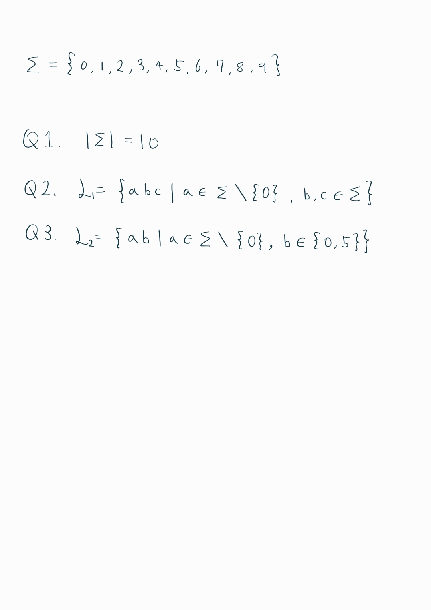

  * 수식이 제대로 보이지 않는다면, 새로고침(F5)을 해주시기 바랍니다.  
  
  
 이번 글을 시작으로 하여, 계산이론의 내용을 다루려고 합니다. 계산이론은 어떠한 문제를 컴퓨터로 풀 수 있는지, 풀 수 있다면 얼마나 효율적으로 풀 수 있는지 등을 탐구하는 학문입니다. 흔히 튜링 머신을 많이 들어보셨을텐데요, 튜링 머신도 계산이론에서 중요하게 다루는 소재 중 하나입니다. 계산이론

  ※선행 지식 
 계산이론 챕터는 다음과 같은 선행 지식을 필요로 합니다. 고등학교 수준의 이해도면 충분합니다. 
 1. 집합론
 2. 수학적 귀납법

## **Alphabet**
'알파벳'하면 A, B, C,...를 떠올려볼 수 있죠? 일반적으로 우리가 영어를 사용할 때 사용하는 알파벳입니다. 이 알파벳도 '알파벳'이 맞습니다만, 계산이론에서는 알파벳을 엄밀하게 정의하고 있습니다.  
**알파벳 $\Sigma$**는 "기호(문자)들의 유한하고 공집합이 아닌 집합"입니다.  
예를 들어 $$\Sigma=\{a,b,c,...,y,z\}$$라고 표현할 수 있습니다. $$\Sigma = \{ a, b, c \}$$도 알파벳입니다. $$\Sigma = \{a \}$$도 알파벳입니다. 모두 알파벳의 정의를 충족하기 때문입니다. 또한 Alphabet의 원소(a, aa, b, c 등)을 **심벌(symbol)**이라고 합니다.  
  
$|\Sigma|$는 심벌의 개수를 의미합니다. 예를 들어 $\Sigma=\{a, aa, b, c\}$라면, $|\Sigma|=4$입니다.  
  
## **String**
문자열(또는 단어) $w$는 어떤 알파벳 $\Sigma$ 위에서 만들어진 **유한한 순서열**입니다.  
$w = a_1 a_2 \cdots a_n$ (각 $a_i \in \Sigma$), 길이는 $|w|=n$입니다.  
예를 들어 $w=abc$이면 $|w|=3$입니다.  
  
그렇다면 길이가 0인 문자열도 존재할까요? 네, 존재합니다.  
길이 0인 특수 문자열을 **빈 문자열(Empty String)**이라 하고 기호 **$\varepsilon$**로 씁니다. 지금은 쓸모없어 보일 수 있어도, 매우 유용한 기호이므로 꼭 기억해두도록 합시다.  

String끼리는 다음 예시처럼 서로 붙일 수 있습니다.  
Example: $u=01$, $v=1$이면 $uv=011$  
  
## **Sigma Star ($\Sigma^*$)와 Sigma Plus ($\Sigma^+$)**

알파벳 $\Sigma$ 위에서 만들 수 있는 **모든 유한 문자열** 집합을 한 번에 모아둔 것이 $\Sigma^\*$이며, 그중 **빈 문자열(Empty String)**을 뺀 것이 $\Sigma^+$입니다.  
  
**Sigma Star:** $$\;\;\Sigma^*=\bigcup_{n\ge 0}\Sigma^n$$
길이 $0$ 이상의 모든 문자열을 포함합니다. **$$\varepsilon\in\Sigma^*$$**  
  
**Sigma Plus:** $$\;\;\Sigma^+=\bigcup_{n\ge 1}\Sigma^n=\Sigma^*\setminus\{\varepsilon\}$$  
길이 **1 이상**의 문자열만 포함합니다. **$$\varepsilon\notin\Sigma^+$$**  
  
> 관계식: $$\;\Sigma^*=\{\varepsilon\}\cup\Sigma^+,\quad \Sigma^+=\Sigma\Sigma^*=\Sigma^*\Sigma$$

다음과 같이 직관적으로 생각해볼 수도 있습니다. $\Sigma^*$는 “$\Sigma$의 기호를 0번 이상 이어 붙인 모든 결과”이고, $\Sigma^+$는 “$\Sigma$의 기호를 1번 이상 이어 붙인 모든 결과로 이해할 수 있습니다. 어렵지 않죠?

## **Language**
알파벳 $\Sigma$ 위의 **언어(Language)** $L$는 $\Sigma^\*$의 **부분집합**입니다. 즉, $L \subseteq \Sigma^\*$이며, 원소는 모두 **문자열**(유한 순서열)입니다. 또한, 문자열 $w$가 언어에 속하면 $w\in L$이라 씁니다.  
  
여기서부터 이해가 어려워지기 시작하는데요, 아래 예시를 보시면 쉽게 이해하실 수 있습니다.  
$$\Sigma=\{a,b\}$$라고 합시다. 그러면 $$\;\;\Sigma^*=\{\varepsilon,a,b,aa,ab,ba,bb,aaa,aab,...\}$$입니다. Language는 $\Sigma$의 subset이라고 말씀드렸죠? Alphabet의 subset 중 $$\{ab,aabb,aaabbb,aaaabbbb,...\}$$를 보겠습니다. 이 집합을 $L$이라고 두면 다음처럼 표현할 수 있습니다. 

$$
\displaystyle
L=\{a^nb^n|n>0\}
$$

다시 한 번 정리를 하자면 alphabet의 부분집합이 Language이므로, Language는 집합의 표현으로 나타낼 수 있습니다. 또한 Language의 원소는 일종의 규칙을 만족하는 Alphabet의 원소들로 이루어진 string입니다.

## **Conclusion**
이번 시간에는 계산이론을 이해하기 위해 필수적이면서도 기초적인 개념인 Alphabet, String, Language의 개념을 알아봤습니다. 아래 연습 문제를 활용하여 개념의 이해도를 다시 한 번 확인하시기 바랍니다. 이번 강의는 여기서 마치겠습니다.

## **Practice** 
Q1-Q2. $$\Sigma = \{0, 1, 2, 3, 4, 5, 6, 7, 8, 9\}$$에 대하여 물음에 답하시오.  
Q1. $|\Sigma|$를 구하시오.  
Q2. 세 자리 자연수를 정확히 표현하는 언어 $L_1\subseteq\Sigma^\*$를 정의하시오.  
Q3. 두 자리 5의 배수를 정확히 표현하는 언어 $L_2\subseteq\Sigma^\*$를 정의하시오.  

### Answer

  
<strong>정답 보기</strong>

   
  

