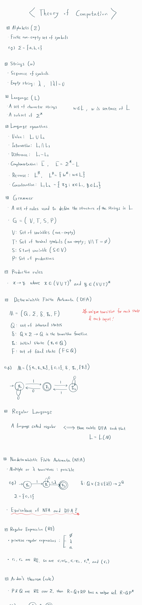
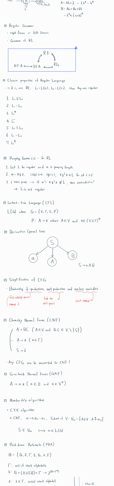
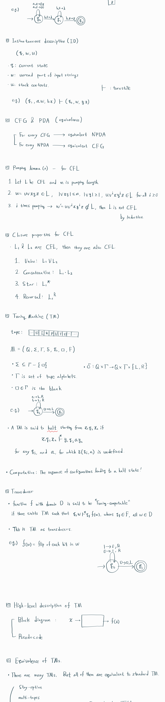
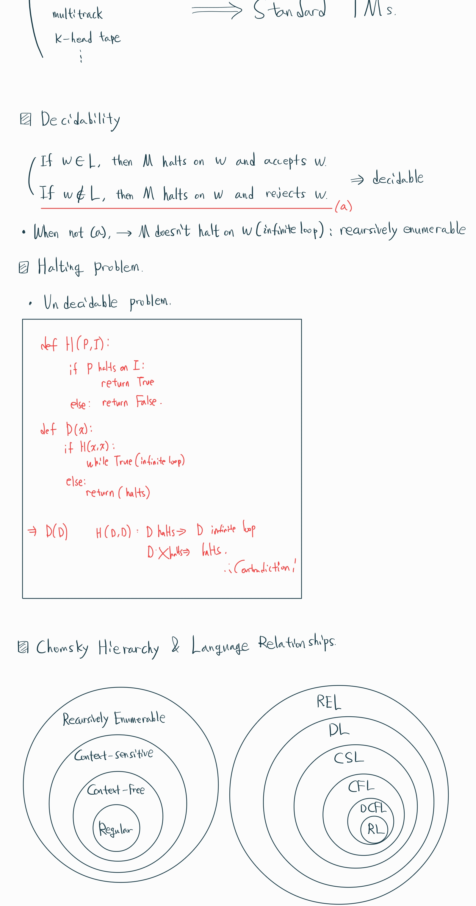

  * 수식이 제대로 보이지 않는다면, 새로고침(F5)을 해주시기 바랍니다.  
  * 참고 교재: An Introduction to Formal Languages And Automata(Peter Linz)

이번 포스팅에서는 제가 계산 이론을 공부하면서 정리한 내용을 요약하여 필기 형태로 담았습니다. 원래는 계산 이론의 모든 내용을 강의로 다뤄보려 하였지만, 내용이 너무 많고 다른 다루고 싶은 내용들도 많아서 이 방식을 채택하게 되었습니다. 다음 필기본을 참고하시어, 계산 이론 공부에 활용하시면 좋을 것 같습니다.

