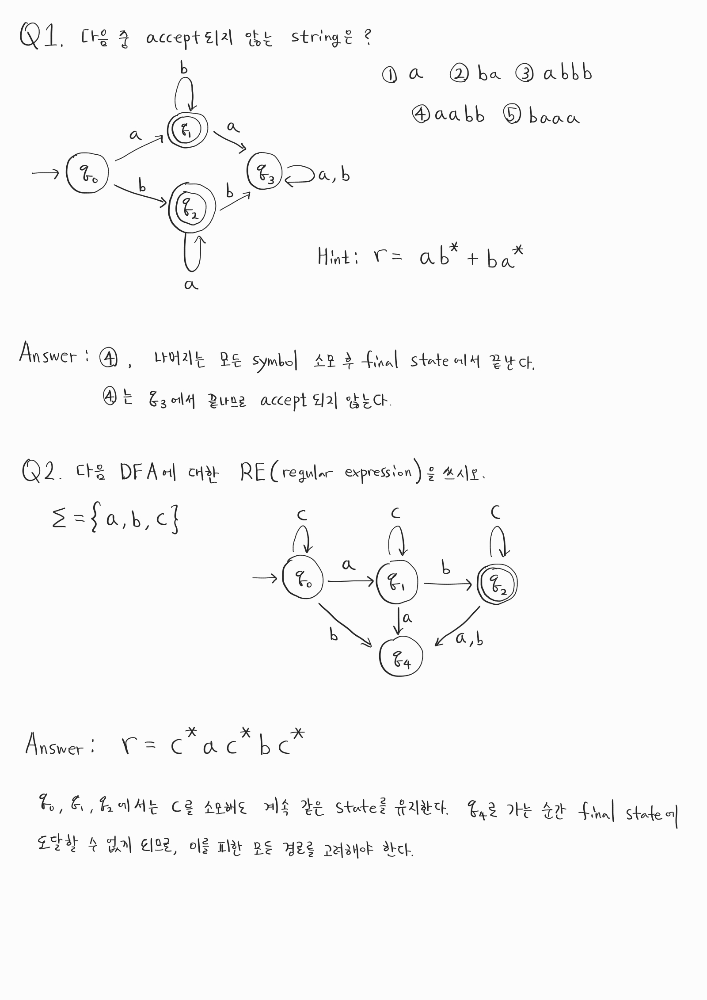

  * 수식이 제대로 보이지 않는다면, 새로고침(F5)을 해주시기 바랍니다.  
  * 참고 교재: An Introduction to Formal Languages And Automata(Peter Linz)

## **Automata**
오토마타(Automata)는 추상적인 연산 장치를 의미합니다. 쉽게 생각하면 컴퓨터를 생각하시면 됩니다. 물론 Automata가 실제 물리적인 기계 장치만을 의미하지만은 않습니다. 계산 할 수 있는 추상적인 연산 장치로 생각하시면 될 것 같습니다. 그리고 '연산 장치가 계산을 할 수 있는가? 할 수 없는가?'를 다루는 학문이 계산 이론입니다.  

## **Deterministic Finite Automata(DFA)**
DFA의 정의는 다음과 같습니다.  
M is DFA, defined by 5-tuples,  $$M=(Q, \Sigma, \delta, q_0, F)$$  
이렇게만 봐서는 당연히 이해가 안됩니다. $$Q$$부터 $$F$$까지 의미를 하나씩 살펴봅시다.  
아래에 DFA의 예시인 그림이 있으니, 설명과 그림을 동시에 참고하시길 바랍니다.  
$$Q$$는 states들의 집합을 의미합니다. 그림에서는 즉, $$Q$$의 원소는 $$q_0, q_1, q_2$$가 됩니다.  
$$\Sigma$$는 지난 강의에서 설명한 의미와 동일합니다. 즉, symbols들의 집합입니다. 아래 그림에서는 a, b가 되겠습니다.  
$$\delta$$는 transition function을 의미합니다. $$\delta(currentState, symbol)$$의 형식으로 표기합니다. 예를 들어 아래 그림에서는 $$q_0$$에서 $b$를 소모하여 $$q_1$$으로 이동할 수 있으므로 $$\delta$$에는 $$\delta(q_0, b)$$가 포함되어 있습니다. 이런 식으로 모든 경로에 대하여 transition function을 가집니다.  
$q_0$는 initial state, $F$는 final state들의 집합을 의미합니다. initial state는 반드시 하나지만, final state는 여러 개 존재할 수 있습니다. 따라서 $q_0$는 element, $F$는 set의 개념입니다.  

또한 정말 중요한 특징이 하나 있는데요, 각 state에서 다른 state로 가리키는 화살표가 symbol당 반드시 하나씩! 존재해야 한다는 특징이 있습니다. 그림을 보시면 각 state에서 빠져나오는 화살표가 모두 2개씩 있고, a, b 각각 하나씩 차지합니다. 매우 중요하니 꼭 기억하시길 바랍니다. NFA에 대해서 미리 말씀드리자면, DFA에서 이 규칙이 깨지면 NFA가 됩니다.

그래프의 노드에 해당하는 부분$$(q_0, q_1, q_2)$$이 state를 나타냅니다. 동그라미가 두 개 그려진 노드$$(q_1)$$가 final state에 해당됩니다. 어떤 string이 이 DFA를 통과하여서 모든 symbol들을 소모하고 끝났을 때 위치가 final state를 통과한다면, 이 DFA를 만족하는 Language에 포함된 string으로 볼 수 있습니다.  
굉장히 중요한 개념이지만, 처음에는 헷갈릴 수 있습니다. 예시를 보시면 바로 이해하실 수 있을 것 같습니다.  
string이 "ab"라고 가정해봅시다. 처음 $$q_0$$로 간 후, $a$를 소모하여 $$q_0$$로 갑니다. 그리고 $$b$$를 소모하여 $$q_1$$에 도착하게 됩니다. 모든 symbol을 사용하였고, final state에서 끝났기 때문에 "ab"는 이 DFA가 표현하는 Language에 포함된 string인 것입니다. 반면 string "a"는 $$q_0$$에서 끝나기 때문에 이 Language 안에 존재하지 않습니다.  
또한 DFA를 만족하는 string들을 몽땅 모든 Language가 있을 때, $$L(M) = \{\, w \in \Sigma^* : \delta^*(q_0, w) \in F \,\}.$$라고 표현합니다.  

### Example
더 많은 예시를 보여드리고 싶은데, 글자만으로는 설명에 한계가 있는 것 같아서 그림을 통해 함께 알아보도록 합시다.  
다음 연습 문제를 직접 풀어보시고, 풀이를 보시면서 개념을 이해해보시는 것을 추천합니다.  

## **Regular Expression**
위 Example에서 Regular Expression에 대해서 간단히 설명드렸는데요, Language에 속할 수 있는 string을 간단히 나타낸 것을 의미합니다. DFA에 대한 Regular Expression은 반드시 존재합니다. 또한 Regular Expression만 봐도, DFA를 그릴 수 있습니다. 이 부분은 연습이 필요한 부분이므로 아래 연습 문제를 활용하여 만든 연습을 해보시는 것을 추천합니다. 물론 쉽게 하는 방법들이 여럿 존재하지만, 본 포스팅에서는 이 부분에 대해서는 디테일하게 다루지 않겠습니다. Regular Expression을 활용하여 DFA를 그리는 방법은 Arden's theorem을 참고하시길 바랍니다.  
[위키백과의 Arden's Rule 문서](https://en.wikipedia.org/wiki/Arden%27s_rule)

## **Conclusion**
이번 시간에는 간단히 DFA와 Regular Expression에 대해 알아보았습니다. 정말 핵심적인 내용만 간결하게 작성하였기 때문에 설명이 부족하다고 느끼셨을 수도 있을 것 같습니다. 설명이 부족하더라도, 아래 연습 문제를 참고하시면 내용 이해에 어려움은 없을 것이라 믿고 있습니다. 아래의 많은 연습 문제를 풀어보시고, 풀이를 꼭 확인하셔서 이해의 정도를 확인하시길 바랍니다. 이번 강의는 풀이를 자세히 해 놓겠습니다.  

## **Practice** 

  

